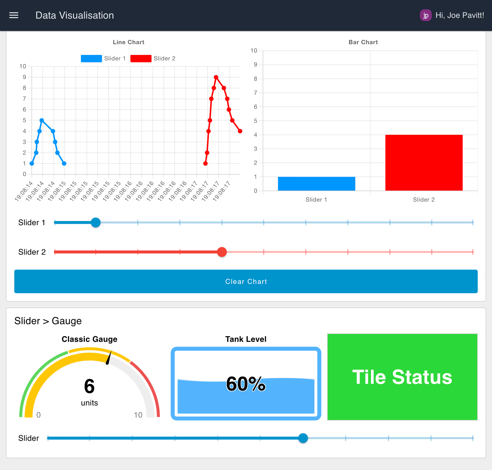

# FlowFuse Dashboard

Documentation can be found here: https://dashboard.flowfuse.com

## Installation

FlowFuse Dashboard is available in the Node-RED Palette Manager. To install it:

- Open the menu in the top-right of Node-RED
- Click "Manage Palette"
- Switch to the "Install" tab
- Search `node-red-dashboard`
- Install the `@flowfuse/node-red-dashboard` package (not `node-red-dashboard`)

The nodes will then be available in your editor for you to get started.

If you want to use `npm` to install your nodes, you can instead [follow these instructions](https://nodered.org/docs/user-guide/runtime/adding-nodes)

### Cloud Hosted Dashboards

If you're looking to host Node-RED in the Cloud, then look no further than [FlowFuse](https://flowfuse.com/). FlowFuse is a fully managed platform for hosting, securing, managing and scaling Node-RED deployments. You can [sign up today for a free trial](https://app.flowfuse.com/account/create).

<div style="text-align: center; margin-bottom: 12px;">
    
    <em style="display: block; text-align: center;">Screenshot of the "Getting Started with FlowFuse Dashboard" blueprint from FlowFuse Cloud</em>
</div>

FlowFuse also comes with a collection of [FlowFuse Dashboard Blueprints](https://flowfuse.com/blueprints/) to help you get started on your FlowFuse Dashboard journey.

## Features

FlowFuse Dashboard provides a base set of nodes for building your own user interfaces and data visualisations. Much like its predecessor, it provides a set of easy-to-use, core nodes, but provides complete flexibility for customisation and control over theming, layout and behaviour if you want to go further.

### Easy Integration

The nodes provided integrate seamlessly with any of the existing nodes and flows you have. Whatever you're trying to control or visualise, you can do it with Node-RED and FlowFuse Dashboard.

### Data Visualization

<div style="text-align: center; margin-bottom: 12px;">
    
    <em style="display: block; text-align: center;">Example of data visualisations in FlowFuse Dashboard</em>
</div>

No dashboard is complete without data visualisation. FlowFuse Dashboard provides a core `ui-chart` widget to provide a simple, yet powerful way to visualise your data. It supports a wide range of chart types, including line, bar and scatter, with more planned for the near future.

### Flexible Customisation

<div style="text-align: center; margin-bottom: 12px;">
    
    <em style="display: block; text-align: center;">Example of a dashboard using custom templates to render a to-do list</em>
</div>

As with Node-RED Dashboard, the new FlowFuse Dashboard, comes with a `ui-template` node which allows you to define your own custom widgets and styling. 

It provides a framework with which you can write raw HTML/JavaScript, define an entire Vue component to render something truly unique and interactive, and override _any_ of the styling of the dashboard using your own custom CSS declarations.

If you're looking to build your own bespoke templates, checkout our useful [UI Template Examples](https://dashboard.flowfuse.com/user/template-examples.html) collection

### Complete Control

`ui-event` and `ui-control` both allow rich insight into interactivity with your dashboard, as well as easy to use control over the dashboard itself, allowing you to dynamically hide and disable content, driven by any criteria of your choosing.

### Build with Markdown & Mermaid

The new `ui-markdown` widget allows you to build rich, interactive applications using [Markdown](https://www.markdownguide.org/) and [Mermaid Charts](https://mermaid.js.org/). You can use Markdown templates to build your UI, and populate it with your own, dynamic data, and then use Mermaid to display dynamic charts and diagrams.

## Project Planning

### Community and Contribution

As an open-source project, FlowFuse Dashboard openly welcomes all forms of contributions, whether those are ideas, bug reports, or code contributions through Pull Requests. 

We strongly believe in the power of community. If you have suggestions, feedback, or features you'd like to see, please open a [GitHub issue](https://github.com/FlowFuse/node-red-dashboard/issues/new/choose). We also highly encourage open-source contributions.

### Roadmap

We are constantly reviewing the priority of our backlog, and have multiple public project management boards where you can keep an eye on what we're working on, and what's coming up next:

- [Activity Tracker](https://github.com/orgs/FlowFuse/projects/15/views/1): See what's being actively worked on, what's up next, and if there are any "Blocked" items you could help with.
- [Node-RED Dashboard Feature Parity](https://github.com/orgs/FlowFuse/projects/15/views/5): We haven't quite yet achieved 100% feature parity with the original Node-RED Dashboard, and this board tracks the progress and priority of those features.

## Motivation

The original [Node-RED Dashboard](https://github.com/node-red/node-red-dashboard) has served us well for many years, providing an intuitive way to create live dashboards for Node-RED flows. However, the original Dashboard is based on Angular v1, which is no longer actively maintained. We identified the need for a secure, updated, and innovative successor.

FlowFuse Dashboard was re-built from the ground up, learning from the popular features and feedback of Node-RED Dashboard. It will carry the legacy forward, adapting to future needs while keeping the essence of open-source and community-driven development intact. The project will is licensed under Apache 2.0.

## Release process

In this project, the [Release Please](https://github.com/googleapis/release-please) is used to automatically determine the next release version based on the commit messages in the codebase.

By using the [Conventional Commits](https://www.conventionalcommits.org/en/v1.0.0/), the project adheres to a standardized format for commit messages, which `Release Please` uses to determine whether the next release should be a major, minor, or patch release.

### Components

1. The `Prepare release` GitHub Action workflow:

    * A Release Please action that analyzes commit messages to determine the type of release required (major, minor, patch) based on the Conventional Commits specification
    * Creates a pre-release pull request with the proposed version bump and changelog
    * Once merged, automatically updates the version number in `package.json` and creates a new release on GitHub with the appropriate changelog

2. The `Lint Pull Request Title` GitHub Action workflow:

    * A workflow that runs on pull request creation and uses the `amannn/action-semantic-pull-request` action to validate that pull request titles follow the Conventional Commits format
    * Together with adjusted default merge commit message, this ensures that all commits merged into the main branch adhere to the expected format, allowing Release Please to function correctly

3. The `Publish Release` GitHub Action workflow:

    * A workflow that runs when a new git tag in `v*.*.*` format is pushed, runs the tests, builds the package and publishes the new version to the public npm registry using the `JS-DevTools/npm-publish` action
    * Once package is published, the workflow updates the package version in the Node-RED Flow Library catalogue

### Pull Request Title Format

The Conventional Commits preset expects pull request titles to be in the following format:

```
<type>(<scope>): <subject>
```

* Type: Describes the category of the commit. Examples include:
    * `feat`: A new feature (triggers a minor version bump).
    * `fix`: A bug fix (triggers a patch version bump).
    * `perf`: A code change that improves performance (triggers a patch version bump).
    * `refactor`: A code change that neither fixes a bug nor adds a feature (does not trigger a release unless it's accompanied by a BREAKING CHANGE).
    * `docs`: Documentation-only changes (does not trigger a release).
    * `chore`: Changes to the build process or auxiliary tools and libraries (does not trigger a release).
* Scope: An optional part that provides additional context about what was changed (e.g., module, component).
* Subject: A brief description of the changes.

### Handling Breaking Changes

To indicate a breaking change, the exclamation mark `!` should be used immediately after the type/scope:

* `feat!:`
* `fix!:`
* `refactor!:`

## License

Apache License 2.0
