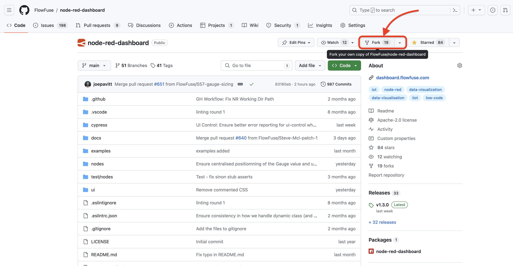

# Contributing

Contributions are always welcome for Dashboard 2.0. We have a lot of great ideas we want to get built, and we'd love to have your help!

## Project Structure

### `/nodes` 

Contains the files each node withat define each of the Node-RED nodes that make up the Dashboard 2.0 node set. You can read more about writing nodes for Node-RED [here](https://nodered.org/docs/creating-nodes/first-node).

### `/ui`

Contains our VueJS app that forms to core of Dashboard 2.0. Within this, `/ui/src/widgets`, you will find the respective `.vue` files for each of the Dashboard 2.0 widgets.

### `/docs`

A [VitePress](https://vitepress.dev/) documentation site that is used to generate the documentation for Dashboard 2.0 (what you're reading now).

## Installing Locally

### Pre-requisites

- [GitHub Account](https://github.com/) - You will need a GitHub account in order to make a copy of the code and contribute any changes.
- [Node.js](https://nodejs.org/en/download) - Node.js will also come package with the Node Package Manager (`npm`) which is used to install dependencies, and run the Dashboard (and Node-RED) locally.
- [Git](https://git-scm.com/downloads) - Git is used to clone the repository locally to your machine, and permits you to push changes back to the central repository on GitHub.

### Clone & Build the Repository

1. **Logon to Appropriate Machine:** Logon to the machine where you have installed Node-RED.

2. **Fork Repository:** Fork this repository to your own Github account:

   {data-zoomable}

3. **Clone Git Repo:** Clone the forked repository from your Github account. This can be anywhere appropriate on your machine (e.g. `/yourname/development/`):
   ```bash
   git clone https://github.com/<your_github_account>/node-red-dashboard.git
   ```

4. **Install Dependencies:** From inside your cloned directory, install all dependent packages (from the `package.json` file):
   ```bash
   cd /node-red-dashboard
   npm install
   ```

5. **Build Dashboard:** Create a static build of the Dashboard's UI, based on Vue CLI (which has been installed in step 3):
    ```bash
    npm run build
    ```

### Install into Node-RED

1. **Navigate to `.node-red`:** In a terminal, navigate to your `.node-red` folder (normally at `~/.node-red`).
   
   ```bash
   cd ~/.node-red
   ```


3. **Remove existing Dashboard 2.0:** Note - if you have already installed this dashboard via your palette, you will need to uninstall it first. This can be done from the Palette Manager in Node-RED, or via `npm` on the terminal:
   ```bash
   npm uninstall @flowfuse/node-red-dashboard
   ```

3. **Install Dashboard 2.0:** Install the forked dashboard into your Node-RED system from inside the `.node-red` folder:
   ```bash
   npm install <path_to_your_forked_dashboard>
   ```

## Making Changes

1. **Make Changes:** Make any appropriate edits.
   - **Node-RED Editor:** For Node-RED node changes, you'll work inside `/nodes` - changes here will require a restart of Node-RED (and refresh of the Node-RED Editor) to see the latest changes.
      - For convenience you can use `npm run watch:node-red` which will restart Node-RED after any changes to `/nodes`
      - This assumes Node-RED is installed at `~/.node-red` and you have `@flowfuse/node-red-dashboard` installed in that folder (as per step 3 above)
   - **Dashboard/UI:** For Dashboard/UI changes, see `/ui` - changes here will require a rebuild of the Dashboard's UI, which can be done by running `npm run build` (as per Step 5. in "Clone & Build the Repository").
      - For convenience you can use `npm run watch:dashboard` which will auto-rebuild after dashboard UI changes 
   - The two watch commands are combined into one command under `npm run watch`

2. **Refresh Browser:** Refresh the dashboard in the browser on `http(s)://your_hostname_or_ip_address:1880/dashboard`
3. **Develop:** Repeat step 1 to 2 over and over again, until you're satisfied with your results.
4. **Create Branch:** Once you're ready to publish your changes, in your cloned repository directory (e.g. `/yourname/development/node-red-dashboard`), create a new branch for all the files of your forked dashboard:
   ```bash
   git checkout -b name_of_your_new_branch
   ```
5. As soon as all your changes work fine, commit your changes:
    ```bash
    git commit -a -m "Description of your changes"
    ```
6.  Push the committed changes to the dashboard fork on your Github account:
    ```bash
    git push origin
    ```
7.  In your forked dashboard repository (on Github), switch to the new branch and [create a pull request](https://docs.github.com/en/pull-requests/collaborating-with-pull-requests/proposing-changes-to-your-work-with-pull-requests/creating-a-pull-request).


## Running Documentation Locally

1. **Run Docs Dev Server:** You can run the documentation locally by running the following command at the root of the `/node-red-dashboard` directory:
   ```bash
   npm run docs:dev
   ```
   This will then run your documentation at `http://localhost:5173/`
2. **Make Changes:** Make any appropriate edits to the documentation (`/docs`). The documentation will live update, no need to re-build, restart the server or refresh the browser.