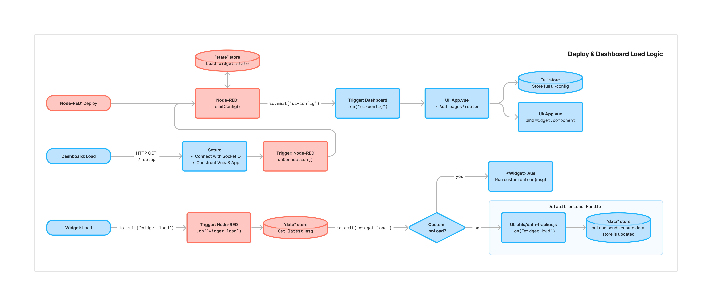
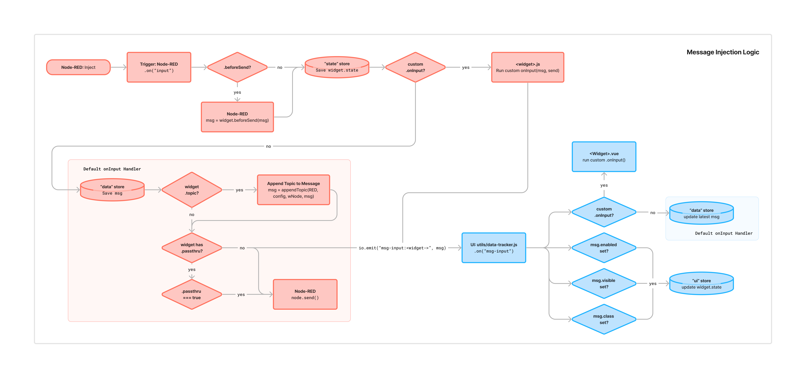
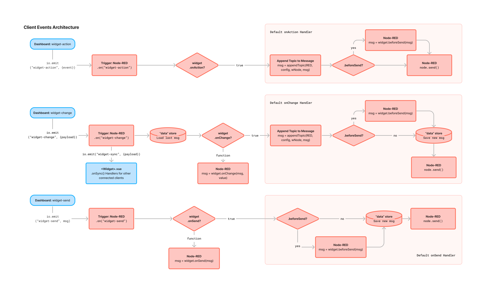

# Ereignisarchitektur

Ein wichtiger Teil des Dashboards ist, wie Node-RED und das Dashboard kommunizieren. Dies wird mit [socket.io](https://socket.io/) erreicht.

Hier finden Sie Details zu den primären Kommunikationswegen zwischen Node-RED (Blöcke in Rot) und dem Dashboard (Blöcke in Blau). Die Blöcke beziehen sich auf bestimmte Funktionen und Dateien im Quellcode, um die Navigation und das Verständnis zu erleichtern, wo der relevante Code zu finden ist.

Jeder der zylindrischen Blöcke bezieht sich direkt auf einen unserer client- oder serverseitigen Speicher, die im [State Management](./state-management.md) Leitfaden detailliert beschrieben sind.

## Architektur

Wir haben die Ereignisarchitektur/-verkehr in drei Hauptgruppen unterteilt:

- **Laden**: Das initiale Laden des Dashboards oder wenn eine neue Konfiguration von Node-RED bei einem frischen "Deploy" gesendet wird.
- **Eingabe**: Wenn eine Nachricht (`msg`) von einem Dashboard-Knoten innerhalb von Node-RED empfangen wird.
- **Dashboard-Aktionen**: Wenn ein Benutzer mit einem Widget interagiert oder ein Widget eine Nachricht zurück an Node-RED sendet.

### "Laden" Ereignisfluss

{data-zoomable}
*Ein Flussdiagramm, das zeigt, wie Ereignisse zwischen Node-RED (rot) und dem Dashboard (blau) bei Bereitstellung und Erstladung verlaufen*

Hier beschreiben wir die initiale "Setup" HTTP-Anfrage, den anschließenden SocketIO-Verkehr und die entsprechenden Handler, die ausgeführt werden, wenn ein Dashboard bereitgestellt wird (über die Node-RED "Deploy"-Option) sowie wenn ein Dashboard-Client erstmals geladen wird.

Beachten Sie die Unterscheidung zwischen einem "Dashboard"-Laden, d.h. der vollständigen App und Browserverbindung, und einem individuellen "Widget"-Laden. Letzteres wird für _jedes_ Widget ausgelöst, wenn es in den DOM eingebunden/gerendert wird.

### "Eingabe" Ereignisfluss

{data-zoomable}
*Ein Flussdiagramm, das zeigt, wie Ereignisse zwischen Node-RED (rot) und dem Dashboard (blau) verlaufen, wenn Nachrichten von einem Dashboard-Knoten empfangen werden*

Dieser Fluss beschreibt die Funktionen und den SocketIO-Verkehr, der auftritt, wenn eine Nachricht von einem Dashboard-Knoten innerhalb von Node-RED empfangen wird. Beachten Sie, dass die meisten Kern-Dashboard 2.0-Widgets den Standard-`onInput`-Handler verwenden, in einigen Fällen jedoch ein benutzerdefinierter `onInput`-Handler verwendet wird, wenn wir ein anderes Verhalten wünschen.

Unser Standard-Server-seitiger `onInput`-Handler behandelt die häufigsten Anwendungsfälle:

- Aktualisieren des Widget-Werts in unserem serverseitigen Datenspeicher
- Überprüfen, ob das Widget so konfiguriert ist, dass es ein `msg.topic` definiert, und falls ja, Aktualisieren der `msg.topic`-Eigenschaft des Widgets
- Überprüfen, ob das Widget mit einer `passthrough`-Option konfiguriert ist, und falls ja, Überprüfen des Werts, bevor das `msg`-Objekt an verbundene Knoten gesendet wird.
- Senden des `msg`-Objekts an verbundene Knoten, falls zutreffend.

### "Dashboard-Aktionen" Ereignisfluss

Verschiedene Widgets lösen je nach spezifischen Anwendungsfällen unterschiedliche Ereignisse aus. Das folgende Diagramm zeigt die drei Arten von Ereignissen, die der Client an den Server senden kann, und wie diese separat behandelt werden.

{data-zoomable}
*Ein Flussdiagramm, das zeigt, wie Ereignisse vom Dashboard (blau) zu Node-RED (rot) verlaufen, wenn ein Benutzer mit dem Dashboard interagiert*

Einige Beispiele für Ereignisse, die vom Dashboard an Node-RED gesendet werden, sind:

- `widget-change` - Wenn ein Benutzer den Wert eines Widgets ändert, z.B. einen Schieberegler oder eine Texteingabe
- `widget-action` - Wenn ein Benutzer mit einem Widget interagiert und der Zustand des Widgets nicht wichtig ist, z.B. ein Klick auf einen Button
- `widget-send` - Wird von `ui-template` verwendet, um ein benutzerdefiniertes `msg`-Objekt zu senden, z.B. `send(msg)`, das im serverseitigen Datenspeicher gespeichert wird.

#### Synchronisierung von Widgets

Das `widget-change`-Ereignis wird verwendet, um Eingaben vom Server zu senden und stellt eine Zustandsänderung für dieses Widget dar, z.B. kann ein Schalter durch einen Benutzerklick ein-/ausgeschaltet werden. In diesem Fall stellt das Dashboard sicher, dass bei mehreren mit demselben Node-RED-Instanz verbundenen Clients die Clients synchron sind, wenn sich Werte ändern.

Zum Beispiel, wenn Sie einen Schieberegler auf einer Instanz des Dashboards bewegen, werden alle verbundenen Schieberegler ebenfalls automatisch aktualisiert.

Um dieses "Single Source of Truth"-Designmuster zu deaktivieren, können Sie den Widget-Typ im ["Client-Daten"](../../user/multi-tenancy#configuring-client-data) Tab der Dashboard-Einstellungen überprüfen.

## Ereignisliste

Dies ist eine umfassende Liste aller Ereignisse, die zwischen Node-RED und dem Dashboard über socket.io gesendet werden.

### `ui-config`
- Nutzlast: `object{ dashboards, theme, pages, groups, widgets }`

Wird verwendet, um Dashboard-/Themen-/Seiten-/Gruppen-/[Widget](#widget)-Layoutdaten zu transportieren, die jeweils durch ihre entsprechenden IDs abgebildet sind.

### `msg-input:<node-id>`
- Nutzlast: `<msg>`

Wird von NR an die UI gesendet, wenn ein msg-Eingang in einen Dashboard-Knoten empfangen wird.

### `widget-load`
- ID: `<node-id>`
- Nutzlast: `none`

Wird von der UI an NR gesendet, wenn die UI/das Widget erstmals geladen wird. Gibt NR die Möglichkeit, dem Widget bekannte vorhandene Werte bereitzustellen.

### `widget-change`
- ID: `<node-id>`
- Nutzlast: `<value>` - typischerweise die Nutzlast-Daten, die im msg gesendet werden sollen

Wird von der UI an NR gesendet, wenn der Wert eines Widgets von der UI geändert wird, z.B. Texteingabe, Schieberegler. Geht davon aus, dass der emittierte Wert die `msg.payload` ist.

Dies nimmt die zuvor empfangene msg und kombiniert sie mit dem neu empfangenen Wert, zum Beispiel, wenn die msg war:

```json
{
    "payload": 30,
    "topic": "on-change"
}
```

und das `widget-change` einen neuen Wert von `40` empfing, dann wäre die neu emittierte Nachricht:

```json
{
    "payload": 40,
    "topic": "on-change"
}
```

Jeder hier empfangene Wert wird auch gegen das Widget im Datenspeicher gespeichert.

### `widget-sync`
- Nutzlast: `<msg>`

Ausgelöst vom serverseitigen `onChange`-Handler. Dies sendet eine Nachricht an alle verbundenen Clients und informiert relevante Widgets über Zustands-/Wertänderungen. Zum Beispiel, wenn ein Schieberegler bewegt wird, stellt die `widget-sync`-Nachricht sicher, dass alle verbundenen Clients und ihre jeweiligen Schieberegler mit dem neuen Wert aktualisiert werden.

### `widget-action`
- ID: `<node-id>`
- Nutzlast: `<msg>`

Wird von der UI an NR gesendet, wenn ein Widget ausgeführt wird, z.B. Klick auf einen Button oder Hochladen einer Datei.

### `widget-send`
- ID: `<node-id>`
- Nutzlast: `<msg>`

Wird im Allgemeinen von `ui-template` verwendet. Dieses Ereignis wird von der Template-`send(msg)`-Funktion umschlossen, die es Benutzern ermöglicht, ihre eigenen vollständigen `msg`-Objekte zu definieren, die von einem `ui-template`-Knoten emittiert werden sollen. Wenn ein Nicht-Objektwert gesendet wird, wird das Dashboard diesen automatisch in ein `msg.payload`-Objekt umwandeln, z.B.:

```js
send(10)
```

führt zu einem `msg`-Objekt von:

```json
{
    "payload": 10 
}
```

Ähnlich, wenn stattdessen ein Objekt angegeben wird:

```js
send({ myVar: 10, topic: "my-topic" })
```

dann wird das `msg`-Objekt sein:

```json
{
    "myVar": 10,
    "topic": "my-topic"
}
```

Jedes `msg`, das mit dieser Funktion emittiert wird, wird auch im Datenspeicher gespeichert, der mit dem Widget verbunden ist.

## Ereignis-Nutzlasten

Dies beschreibt einige der Objektstrukturen, die verwendet werden, um Daten über die Socket-IO-Verbindungen zwischen Node-RED und dem Dashboard zu senden.

### `Widget`

Innerhalb der `ui-config` ist die `widgets`-Eigenschaft ein Array von `Widget`-Objekten. Jedes `Widget`-Objekt hat die folgenden Eigenschaften:

- **id**: Die von Node-RED zugewiesene ID, um diesen Knoten im Editor eindeutig zu identifizieren
- **props**: Die Sammlung von Eigenschaften, die der Benutzer im Editor für diesen Knoten definieren kann
- **component** - Die jeweilige Vue-Komponente, die für das Rendering erforderlich ist, hinzugefügt im Frontend (in App.vue)
- **state** - Enthält Werte, die den visuellen und interaktiven "Zustand" eines Widgets definieren, z.B. `enabled: true` oder `visible: false` (`visible:` wird noch nicht unterstützt)