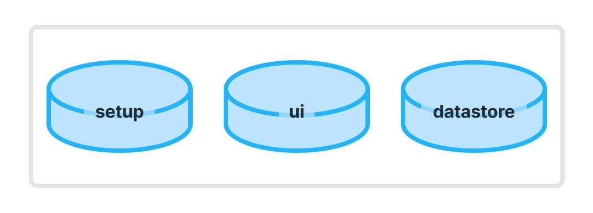
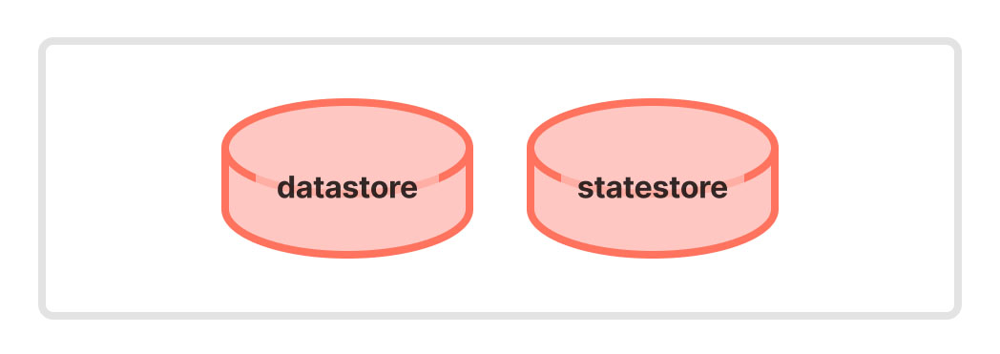

# Zustandsmanagement

Dashboard 2.0 bietet einen Datenspeicher innerhalb von Node-RED, sodass es möglich ist, Ihre Dashboard-Clients zu aktualisieren und Daten beizubehalten. Dies ist besonders nützlich für Widgets wie `ui-chart`, bei denen Sie möglicherweise eine Historie von Datenpunkten beibehalten möchten, oder für Widgets wie `ui-text`, bei denen Sie den zuletzt angezeigten Wert beibehalten möchten.

Diese Seite beschreibt die verschiedenen "Stores", die wir eingerichtet haben, und wofür sie verwendet werden.

Sie können sich auch die [Ereignisarchitektur](./events.md) ansehen, um einen detaillierteren Einblick zu erhalten, wann diese Stores verwendet werden und wie sie mit dem Rest des Dashboards interagieren.

## Client-Seite (Dashboard)

{data-zoomable}
*Ein Bild, das die drei clientseitigen Vuex-Stores zeigt, die wir im Dashboard 2.0 haben*

Unsere clientseitigen Stores basieren auf [VueX](https://vuex.vuejs.org/). Diese Stores verlieren ihre Daten bei einem Client-Refresh (werden jedoch von den serverseitigen Stores neu befüllt) und werden nur verwendet, um eine zentralisierte, konsistente Ansicht der Daten über die gesamte Vue-Anwendung hinweg zu erhalten, während der Benutzer im Dashboard navigiert.

### `setup` Store

Dieser speichert nur die Antwort von unserer initialen `/_setup`-Anfrage. Dieses Objekt enthält im Kern die SocketIO-Konfiguration, um dem Client zu helfen, sich mit dem Server zu verbinden.

Es ist auch möglich, dass Plugins diesem Objekt (siehe [Plugins hinzufügen](../plugins/#index-js)) zusätzliche Daten hinzufügen, die in der gesamten Anwendung nützlich sein können.

### `ui` Store

In diesem Store speichern wir die vollständige [ui-config](./events#ui-config), die alle Seiten, Themen, Gruppen und Widgets beschreibt, die auf einem Dashboard gerendert werden sollen.

### `data` Store

Der clientseitige Datenspeicher ist eine Zuordnung von Widget-IDs zu entweder:

- Der letzten `msg`, die vom Widget empfangen wurde
- Einem Array von `msg`-Objekten, das alle bekannten `msg`-Objekte darstellt, die vom Widget empfangen wurden

In den meisten Fällen benötigt ein Widget nur einen Verweis auf die _letzte_ Nachricht. In einigen Fällen, z.B. `ui-chart`, ist die vollständige Historie erforderlich, um eine Historie von Daten darzustellen.

Wenn ein Widget zum ersten Mal geladen wird, senden wir ein `widget-load`-Ereignis, das im Standard-`onLoad`-Handler versucht, die letzte vom Widget empfangene Nachricht aus dem serverseitigen Datenspeicher abzurufen und im clientseitigen `data` Store zu speichern. Mehr darüber erfahren Sie in der [Ereignisarchitektur](./events.md).

Es ist möglich, dass ein Widget auf das zugeordnete `msg`-Objekt zugreift, indem es:

```vue
<template>
    <pre>this.messages[this.id]</pre>
</template>
<script>
export default {
    computed: {
        ...mapState('data', ['messages'])
    }
}
</script>
```
_Ein Beispiel für eine Widget.vue-Datei, die den `data` Store verwendet, um auf die letzte vom Widget empfangene Nachricht zuzugreifen_

Dieser Wert wird auch automatisch aktualisiert, wenn eine neue Nachricht empfangen wird, solange dieses Widget die Standardhandler verwendet, die ebenfalls in der [Ereignisarchitektur](./events.md) beschrieben sind.


## Server-Seite (Node-RED)

{data-zoomable}
*Ein Bild, das die zwei serverseitigen Stores zeigt, die wir im Dashboard 2.0 haben*

Unsere serverseitigen Stores pflegen die "Single Source of Truth". Wenn sich ein Dashboard-Client verbindet, werden die zentralisierten Daten an jeden Client gesendet, und die clientseitigen Stores werden mit den relevanten Teilen dieses zentralisierten Stores befüllt.

In unserer serverseitigen Architektur verwenden wir zwei eigenständige Stores:

- `datastore`: Eine Zuordnung jedes Widgets zur neuesten `msg`, die von einem entsprechenden Knoten im Editor empfangen wurde.
- `statestore`: Ein Store für alle dynamischen Eigenschaften, die auf Widgets gesetzt sind (z.B. Sichtbarkeit oder das Setzen einer Eigenschaft zur Laufzeit). Oft sind diese Werte Überschreibungen der Basis-Konfiguration, die im `datastore` gefunden wird.

Jedes Mal, wenn eine Funktion serverseitig in diese Stores schreiben möchte, wird eine Überprüfung durchgeführt, um sicherzustellen, dass alle bereitgestellten Nachrichten gespeichert werden dürfen. Ein Beispiel dafür, wo dies blockiert würde, ist, wenn `msg._client.socketid` angegeben ist und der relevante Knotentyp so eingerichtet ist, dass er auf Socket-Einschränkungen hört (standardmäßig sind dies `ui-control` und `ui-notification`). In diesem Fall möchten wir diese Daten nicht in unserem zentralisierten Store speichern, da sie nicht für _alle_ Benutzer des Dashboards relevant sind.


### Stores importieren

Stores werden in die `.js`-Datei eines Knotens importiert mit:

```js
const store = require('<path>/<to>/store.js')
```

### Daten Store

Der serverseitige `datastore` ist ein zentralisierter Store für alle Nachrichten, die von Widgets im Editor empfangen werden. Es ist ein einfacher Key-Value-Store, wobei der Schlüssel die ID des Widgets ist und der Wert die vom Widget empfangene Nachricht ist. In einigen Fällen, z.B. `ui-chart`, speichern wir anstelle der _nur_ neuesten empfangenen `msg` tatsächlich eine Historie.

#### `datastore.save`

Wenn ein Widget eine Nachricht empfängt, speichert der Standard-`node.on('input')`-Handler die empfangene Nachricht, die der ID des Widgets im Datenspeicher zugeordnet ist, mit:

```js
datastore.save(base, node, msg)
```

- `base`: Der `ui_base`-Knoten, an den der Store angehängt ist
- `node`: Das Node-RED-Knotenobjekt, für das wir den Zustand speichern
- `msg`: Die Nachricht, die vom Knoten empfangen wurde

Dies speichert die letzte vom Widget empfangene Nachricht, die von demselben Widget beim Laden abgerufen werden kann mit:

#### `datastore.get`

Wenn ein Widget initialisiert wird, versucht es, die neueste Nachricht aus dem Datenspeicher abzurufen mit:

```js
datastore.get(node.id)
```

Dies stellt sicher, dass beim Aktualisieren des Clients oder wenn neue Clients nach der Datengenerierung verbunden werden, der Zustand konsistent dargestellt wird.

#### `datastore.append`

Mit `.append` können wir mehrere Nachrichten gegen dasselbe Widget speichern, was eine Historie des Zustands darstellt, anstatt nur einen einzigen Punktverweis auf den _letzten_ Wert.

```js
datastore.append(base, node, msg)
```

- `base`: Der `ui_base`-Knoten, an den der Store angehängt ist
- `node`: Das Node-RED-Knotenobjekt, für das wir den Zustand speichern
- `msg`: Die Nachricht, die vom Knoten empfangen wurde

Dies wird in `ui-chart` verwendet, um die Historie von Datenpunkten zu speichern, wobei jeder Datenpunkt eine individuelle Nachricht sein könnte, die vom Widget empfangen wurde.

#### `datastore.clear`

Wenn ein Widget aus dem Editor entfernt wird, können wir den Datenspeicher von allen gegen dieses Widget gespeicherten Nachrichten löschen mit:

```js
datastore.clear(node.id)
```

Dies stellt sicher, dass wir keine veralteten Daten im Datenspeicher haben und dass wir keine Daten gegen Widgets gespeichert haben, die nicht mehr im Editor existieren.

### Zustands Store

Der `statestore` ist ein zentralisierter Store für alle dynamischen Eigenschaften, die gegen Widgets im Editor gesetzt sind. Dynamische Eigenschaften können durch das Senden von `msg.<property>`-Payloads an einen gegebenen Knoten gesetzt werden, z.B. für `ui-dropdown` können wir `msg.options` senden, um die "Options"-Eigenschaft zur Laufzeit zu überschreiben.

Auf der obersten Ebene ist es key-mapped zu den Widget-IDs, dann hat jedes Widget eine Zuordnung, wobei jeder Schlüssel der Eigenschaftsname ist, der auf den Wert verweist.

#### `statestore.getAll`

Für eine gegebene Widget-ID alle gesetzten dynamischen Eigenschaften zurückgeben.

```js
statestore.getAll(node.id)
```

#### `statestore.getProperty`

Für eine gegebene Widget-ID den Wert einer bestimmten Eigenschaft zurückgeben.

```js
statestore.getProperty(node.id, property)
```

#### `statestore.set`

Gegeben eine Widget-ID und Eigenschaft, den zugehörigen Wert in der entsprechenden Zuordnung speichern

```js
statestore.set(base, node, msg, property, value)
```

- `base`: Der `ui_base`-Knoten, an den der Store angehängt ist
- `node`: Das Node-RED-Knotenobjekt, für das wir den Zustand speichern
- `msg`: Die Nachricht, die vom Knoten empfangen wurde
- `property`: Der zu speichernde Eigenschaftsname
- `value`: Der Wert, der gegen die Eigenschaft gespeichert werden soll

#### `statestore.reset`

Alle dynamischen Eigenschaften für ein gegebenes Widget/Node entfernen.

```js
statestore.reset(node.id)
```