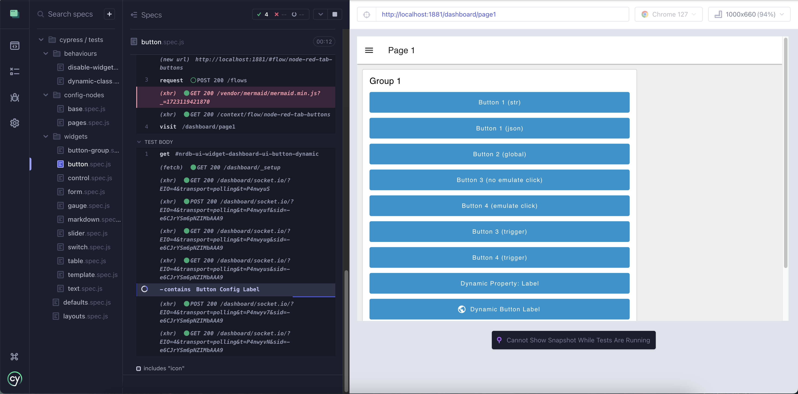

# E2E-Testing

E2E-Testing besteht darin, eine lokale Umgebung auszuführen und die Interaktion mit dem Browser zu automatisieren, um das Verhalten der Widgets zu testen.

Mit Dashboard 2.0 haben wir die folgenden Befehle, die für Tests verwendet werden:

- `npm run cy:server` - Führt eine Instanz von Node-RED mit installiertem Dashboard 2.0 aus.
- `npm run cy:run` - Führt alle Cypress-Tests im Headless-Modus aus.
- `npm run cy:open` - Öffnet den Cypress-Test-Runner, in dem Sie explizit auswählen können, welche Tests lokal ausgeführt werden sollen.

## Cypress

Für unser E2E-Testing verwenden wir [Cypress](https://www.cypress.io/). Dies bietet ein Framework, mit dem wir automatisierte Tests definieren können, die auf relevante Elemente in unserem Dashboard klicken und mit ihnen interagieren und gegen erwartete Verhaltensweisen prüfen.

## Tests ausführen

### Node-RED-Testinstanz installieren

Cypress wurde so konfiguriert, dass eine lokale Instanz von Node-RED mit installiertem Dashboard 2.0 ausgeführt wird. Sie müssen die Abhängigkeiten für diese Instanz installieren:

```bash
cd ./cypress/fixtures/user-dir/
npm install
```

### Testserver ausführen

Um den Testserver auszuführen, müssen Sie den folgenden Befehl aus dem Stammverzeichnis des Repositories ausführen:

```bash
npm run cy:server
```

Der Testserver wird unter `http://localhost:1881` ausgeführt, und jedes resultierende Dashboard wird unter `http://localhost:1881/dashboard` verfügbar sein.

### Cypress öffnen

Um den Cypress-Test-Runner zu öffnen, müssen Sie den folgenden Befehl aus dem Stammverzeichnis des Repositories ausführen:

```bash
npm run cy:open
```

Wählen Sie "E2E-Testing" und dann den Browser Ihrer Wahl. Danach sehen Sie eine Liste der verfügbaren Tests, die Sie dann einzeln ausführen können.


_Screenshot, der die UI-Button-Tests im Cypress-Test-Runner zeigt_


## Tests schreiben

Mit Node-RED und Dashboard 2.0 möchten wir in der Lage sein, ein vollständiges `flow.json` bereitzustellen und dann das Verhalten des Dashboards zu testen, das als Ergebnis dieses Flows bereitgestellt wird.

Daher enthält jeder Testsatz zwei Hauptteile:

1. `<widget>.json` - das `flows.json`, das die zu bereitstellenden Testflows detailliert beschreibt, gespeichert in `/cypress/fixtures/flows`
2. `<widget>.spec.js` - die Testsuite, die definiert, mit welchen Elementen interagiert werden soll und welche Zustände getestet werden sollen, gespeichert in `/cypress/tests/`

### 1. Testflows erstellen

Jede Testsuite hat eine entsprechende `flows.json`-Datei, die den Flow beschreibt, der in der lokalen Node-RED-Instanz bereitgestellt werden soll. Diese enthält die notwendigen Knoten, um das Verhalten des betreffenden Widgets zu testen.

Der einfachste Weg, dieses `flow.json` zu erstellen, ist direkt in Node-RED:

1. Erstellen Sie den Flow, den Sie in einer lokalen Node-RED-Instanz testen möchten
2. Exportieren Sie ihn als JSON
3. Speichern Sie das exportierte `json` in einer `json`-Datei innerhalb von `/cypress/fixtures/flows`

Sie möchten möglicherweise auch die [Cypress-Test-Helfer](#cypress-test-helpers) nutzen.

### 2. Beispiel `spec.js`-Datei

Um auf Ihr relevantes `flow.json` zu verweisen, können Sie die `cy.deployFixture`-Hilfsfunktion verwenden, die den Flow in die lokale Node-RED-Instanz lädt.

```js
describe('Node-RED Dashboard 2.0 - Button Groups', () => {
    // alles hier wird vor allen einzelnen Tests unten ausgeführt
    beforeEach(() => {
        // hier können wir unseren Hilfsbefehl verwenden, um ein flow.json zu laden
        cy.deployFixture('dashboard-button-groups')
        // dann sicherstellen, dass wir für jeden Test auf der richtigen Seite beginnen
        cy.visit('/dashboard/page1')
    })

    // it('') spezifiziert einen neuen Test
    it('can be clicked and emit a string value representing the option', () => {
        // clickAndWait ist ein Hilfsbefehl, der auf ein Element klickt und eine festgelegte Zeit wartet
        cy.clickAndWait(cy.get('button').contains('Option 3'))
        
        // checkOutput nutzt dann die Helper-APIs, die wir eingerichtet haben, um zu überprüfen, welche Ausgabe vom Button kam
        cy.checkOutput('msg.topic', 'first-row')
        cy.checkOutput('msg.payload', 'option_3')
    })

    it('allows for definition of custom colouring for options', () => {
        // Klicken Sie auf den letzten Button in der Button-Gruppe
        cy.clickAndWait(cy.get('#nrdb-ui-widget-ui-button-group-colors button').last())

        // überprüfen, ob das CSS korrekt angewendet wird
        cy.get('#nrdb-ui-widget-ui-button-group-colors button').last()
            .should('have.css', 'background-color', 'rgb(217, 255, 209)')
    })
})
```

## Cypress-Test-Helfer

### Click & Wait

`cy.clickAndWait(<element>)`

Cypress wartet automatisch darauf, dass Elemente im DOM erscheinen, bevor es mit ihnen interagiert, und wartet bei Anweisung auf HTTP-Anfragen, jedoch kann es dasselbe nicht für Websocket-Verkehr tun.

Da die meisten Tests die Überprüfung der Konsequenzen des SocketIO-Verkehrs beinhalten, haben wir einen Cypress-"Befehl" erstellt, `clickAndWait()`, der sicherstellt, dass nach dem Klicken eine festgelegte Zeitspanne vergeht, bevor zum nächsten Testschritt übergegangen wird.

### Ausgabe speichern (Funktionsknoten)

Um das Schreiben von Tests zu erleichtern, haben wir eine Hilfsfunktion erstellt, die verwendet werden kann, um die Ausgabe von bestimmten Widgets zu testen. Dieser Funktionsknoten kann in Ihren Node-RED-Flow aufgenommen werden und speichert das `msg`-Objekt in einem `global`

<iframe width="100%" height="250px" src="https://flows.nodered.org/flow/51259d06082d56dd79725d7675f6c4bc/share" allow="clipboard-read; clipboard-write" style="border: none;"></iframe>

Der Funktionsknoten "Store Latest Msg" enthält:

```js
global.set('msg', msg)
return msg;
```

Wenn ein Button im Dashboard geklickt wird, wird der von diesem Button ausgegebene Wert in einer globalen `msg`-Variablen gespeichert. Wir können dies dann in Verbindung mit der Überprüfung dieser Ausgabe verwenden.

### Ausgabe überprüfen

`cy.checkOutput(<key>, <value>)`

Wenn Sie den oben genannten [Store Output](#store-output-function-node) Funktionsknoten verwenden, können wir dann den `checkOutput`-Befehl verwenden, um den Wert des `msg`-Objekts mit dem zu vergleichen, was wir erwarten.

Dieser Hilfsflow wird automatisch in die Node-RED-Instanz bereitgestellt, wenn der `deployFixture(<fixture>)`-Befehl verwendet wird.

<iframe width="100%" height="250px;" src="https://flows.nodered.org/flow/85116e5ecfdb9da778bbbbfe34c0063b/share" allow="clipboard-read; clipboard-write" style="border: none;"></iframe>

Zum Beispiel aus unseren Button-Tests:

```js
describe('Node-RED Dashboard 2.0 - Buttons', () => {
    beforeEach(() => {
        cy.deployFixture('dashboard-buttons') // liest ein flow.json ein und stellt es in der lokalen Node-RED-Instanz bereit
        cy.visit('/dashboard/page1')
    })

    it('can be clicked and outputs the correct payload & topic are emitted', () => {
        // Strings ausgeben
        cy.clickAndWait(cy.get('button').contains('Button 1 (str)'))
        // checkOutput ruft unsere Hilfsendpunkte auf, um die Werte mit der gespeicherten msg zu vergleichen
        cy.checkOutput('msg.payload', 'button 1 clicked')
        cy.checkOutput('msg.topic', 'button-str-topic')

        // JSON ausgeben
        cy.clickAndWait(cy.get('button').contains('Button 1 (json)'))
        cy.checkOutput('msg.payload.hello', 'world')
        cy.checkOutput('msg.topic', 'button-json-topic')
    })
})
```

### Kontext zurücksetzen

`cy.resetContext()`

Die obige Funktion hilft beim Setzen und Überprüfen von Ausgaben, die auf den "Kontext"-Speichern von Node-RED beruhen. Diese Funktion kann verwendet werden, um sicherzustellen, dass Sie einen sauberen Kontextspeicher haben, indem Sie ihn zurücksetzen. Dies wird am besten _vor_ der Verwendung der [Store Output](#store-output-function-node) Hilfsfunktion verwendet, um neue Werte im Speicher zuzuweisen.

### Dashboard neu laden

`cy.reloadDashboard()`

Wenn Sie zu irgendeinem Zeitpunkt die Seite neu laden möchten, wird durch die Nutzung dieses Befehls die Seite aktualisiert, aber auch sichergestellt, dass der `/_setup`-API-Aufruf abgeschlossen ist, bevor mit weiteren Schritten in Ihrem Test fortgefahren wird.