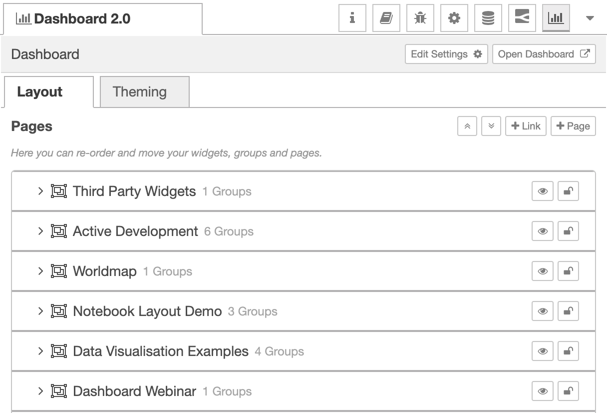
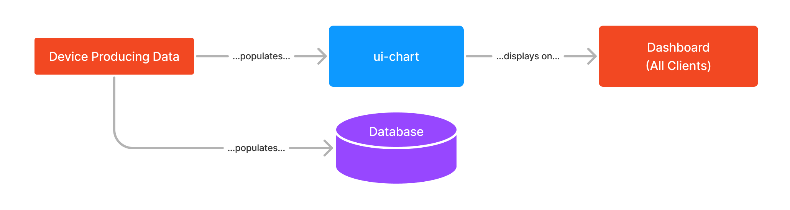
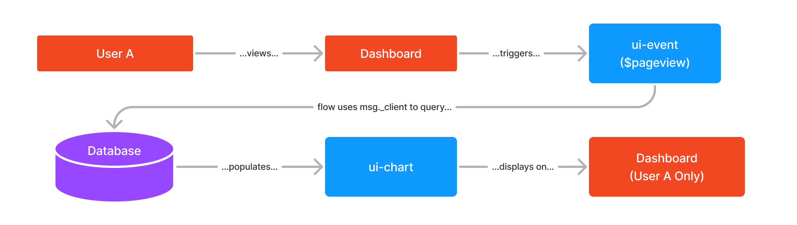

# Erste Schritte

## Über

Willkommen zur Dokumentation für das Node-RED Dashboard 2.0, den Nachfolger des ursprünglichen und sehr beliebten Node-RED Dashboards.

Dieses Projekt wurde von FlowFuse ins Leben gerufen, um das ursprüngliche Dashboard zu aktualisieren und sich von Angular v1.0 zu entfernen, das [offiziell veraltet](https://flowfuse.com/blog/2024/06/dashboard-1-deprecated/) ist. Unsere vollständige Erklärung, warum wir Dashboard 2.0 entwickeln, können Sie [hier](https://flowfuse.com/blog/2023/06/dashboard-announcement/?_gl=1*cckr5u*_gcl_au*MTAzMTA0MzY1Ni4xNzE2MzY2NTAz) lesen.

## Empfohlene Tutorials

<RecommendedTutorials />

## Installation

Das Node-RED Dashboard 2.0 von [FlowFuse](https://flowfuse.com) ist im Node-RED Palette Manager verfügbar. Um es zu installieren:

- Öffnen Sie das Menü oben rechts in Node-RED
- Klicken Sie auf "Palette verwalten"
- Wechseln Sie zum Tab "Installieren"
- Suchen Sie nach `node-red-dashboard`
- Installieren Sie das Paket `@flowfuse/node-red-dashboard` (nicht `node-red/node-red-dashboard`)

{data-zoomable}
*Screenshot, der die im Node-RED Palette Manager verfügbaren Knoten zeigt*

Die Knoten sind dann in Ihrem Editor verfügbar, damit Sie loslegen können.

Wenn Sie `npm` verwenden möchten, um Ihre Knoten zu installieren, können Sie stattdessen [diesen Anweisungen](https://nodered.org/docs/user-guide/runtime/adding-nodes) folgen.

## Dashboard-Hierarchie

Jedes Dashboard ist eine Sammlung von Widgets (z. B. Diagramme, Schaltflächen, Formulare), die in unserer eigenen Benutzeroberfläche konfiguriert und angeordnet werden können. Die Hierarchie eines Dashboards ist wie folgt:

- **Basis** - Definiert die Basis-URL (z. B. `/dashboard`) für Ihr Dashboard.
- **Seite** - Eine bestimmte Seite, zu der ein Besucher navigieren kann, die URL wird die Basis erweitern, z. B. `/dashboard/page1`. Jede Seite kann auch ein definiertes, einzigartiges Thema haben, das das Styling aller Gruppen/Widgets auf der Seite steuert.
- **Gruppe** - Eine Sammlung von Widgets. Auf einer Seite gerendert.
- **Widget** - Ein einzelnes Widget (z. B. Diagramm, Schaltfläche, Formular), das im Dashboard erstellt wurde.

## Hinzufügen Ihrer ersten Widgets

Mit den installierten Knoten ist der Einstieg so einfach wie das Auswählen eines Knotens aus der Palette (der Liste der Knoten auf der linken Seite) in Node-RED und das Ablegen auf Ihrer Leinwand.

{data-zoomable}
_Bildschirmaufnahme, um zu zeigen, wie einfach es ist, Ihre erste Dashboard 2.0-Anwendung bereitzustellen._

In diesem Fall fügen wir einen `ui-button` hinzu, klicken auf "Bereitstellen" und können dann die Schaltfläche live in unserer Benutzeroberfläche sehen.

Beachten Sie auch, dass das Dashboard automatisch eine neue Gruppe, Seite, Thema und Basis-Dashboard für Sie erstellt.

## Konfigurieren Ihres Layouts

Dashboard 2.0 fügt der Node-RED-Editor eine entsprechende "Dashboard 2.0"-Seitenleiste hinzu. Diese Seitenleiste bietet eine Schnittstelle, um Ihre Seiten, Themen, Gruppen und Widgets anzuzeigen. Von hier aus können Sie neue Seiten und Gruppen hinzufügen, bestehende Einstellungen ändern und Inhalte nach Belieben neu anordnen.

{data-zoomable}
_Screenshot, der die Dashboard 2.0-Seitenleiste im Node-RED-Editor zeigt._

Layout-Optionen in einer Dashboard 2.0-Benutzeroberfläche werden durch zwei Haupteinstellungen gesteuert:

- **Seitenlayout:** Steuert, wie die `ui-groups` auf einer bestimmten Seite in Ihrer Anwendung präsentiert werden.
- **Navigationsseitenleiste:** Definiert den Navigationsstil auf der linken Seite, der auf der `ui-base`-Ebene definiert ist.

{data-zoomable}
_Beispiel des "Grid"-Seitenlayouts mit einer "Collapsing"-Seitenleiste._

### Standardseite

Jede Seite in Dashboard 2.0 hat eine eindeutige URL. Wenn ein Benutzer zu einem nicht erkannten Pfad unter dem `/dashboard/`-Pfad navigiert, wird eine Standardseite verwendet, um darauf zurückzugreifen.

Derzeit wird in Dashboard 2.0 die Standardseite als die Seite gewählt, die in der Liste der Seiten in der Seitenleiste zuerst geordnet ist:

{data-zoomable}
_Screenshot der Seitenliste im Dashboard 2.0-Seitenbereich_

In diesem Beispiel ist die Seite _"Third Party Widgets"_ die Standardseite.

### Layout-Optionen

Derzeit haben wir drei verschiedene Optionen für das Layout einer Seite:

- **Grid:** ([docs](https://dashboard.flowfuse.com/layouts/types/grid.html)) Das Standardlayout für eine Seite. Es verwendet eine 12-Spalten-Rasterstruktur, um die Gruppen anzuordnen. Die Breiten jeder Gruppe oder jedes Widgets definieren die Anzahl der Spalten, in denen sie gerendert werden. Eine "Breite" von 6" würde also 50% des Bildschirms einnehmen. Rasterlayouts sind vollständig responsiv und passen sich der Bildschirmgröße an.
- **Fixed:** ([docs](https://dashboard.flowfuse.com/layouts/types/fixed.html)) Jedes Element wird unabhängig von der Bildschirmgröße in einer _festen_ Breite gerendert. Die "Breite"-Eigenschaft wird in einen festen Pixelwert umgewandelt (standardmäßig Vielfache von 48px).
- **Notebook:** ([docs](https://dashboard.flowfuse.com/layouts/types/notebook.html)) Dieses Layout wird auf 100% Breite gestreckt, bis zu einer maximalen Breite von 1024px, und wird zentral ausgerichtet. Es ist besonders nützlich für Storytelling (z. B. Artikel/Blogs) oder Analyse-Benutzeroberflächen (z. B. Jupyter Notebooks), bei denen der Benutzer Inhalte in einer bestimmten Reihenfolge durch Scrollen aufnehmen soll.
- **Tabs:** ([docs](https://dashboard.flowfuse.com/layouts/types/tabs.html)) Dieses Layout organisiert Inhalte in separate Registerkartenabschnitte, sodass Benutzer zwischen verschiedenen Ansichten oder Inhaltskategorien wechseln können, ohne die Seite zu verlassen. Jede Registerkarte kann mehrere Gruppen und Widgets enthalten und ist besonders nützlich, um große Mengen an Informationen in leicht verdauliche Segmente zu organisieren. Das "Tabs"-Layout sorgt für eine bessere Navigation und eine sauberere Benutzeroberfläche, wenn mehrere Inhaltskategorien in einer einzigen Ansicht angezeigt werden müssen.

### Navigationsseitenleiste

In das Framework der Benutzeroberfläche ist eine Seitenleiste zur Navigation integriert, zusammen mit der oberen, seitenweiten "App-Leiste". Es gibt Konfigurationsoptionen, mit denen das Verhalten der Seitennavigation gesteuert werden kann. Optionen umfassen:

- **Collapsing:** Wenn die Seitenleiste geöffnet ist, passt sich der Seiteninhalt an die Breite der Seitenleiste an.
- **Fixed:** Die vollständige Seitenleiste wird immer sichtbar sein, und der Seiteninhalt passt sich der Breite der Seitenleiste an.
- **Collapse to Icons:** Wenn minimiert, können Benutzer weiterhin zwischen Seiten navigieren, indem sie auf die Symbole klicken, die jede Seite in der Seitenleiste darstellen.
- **Appear over Content:** Wenn die Seitenleiste geöffnet ist, erhält die Seite eine Überlagerung, und die Seitenleiste sitzt oben.
- **Always Hide:** Die Seitenleiste wird niemals angezeigt, und die Navigation zwischen den Seiten kann stattdessen durch [`ui-control`](https://dashboard.flowfuse.com/nodes/widgets/ui-control.html) gesteuert werden.

## Designmuster

Es gibt zwei grundlegende Designmuster, die beim Erstellen mit Dashboard 2.0 möglich sind:

- **Single Source of Truth:** Alle Benutzer Ihres Dashboards sehen die gleichen Daten. Dies ist nützlich für industrielle IoT- oder Heimautomatisierungsanwendungen.
- **Multi Tenancy:** Die in einem bestimmten Widget angezeigten Daten sind für einen bestimmten Client/Sitzung/Benutzer einzigartig. Dies stellt eine traditionellere Webanwendung dar, bei der jeder Benutzer seine eigene Sitzung und zugehörige Daten hat.

Es ist erwähnenswert, dass diese beiden Muster innerhalb einer einzigen Dashboard 2.0-Anwendung gemischt und kombiniert werden können, wie [später](#example) gezeigt wird.

### Single Source of Truth

{data-zoomable}
_Beispielworkflow zur Demonstration des "Single Source of Truth"-Designmusters._

Dies ist das Muster, das das ursprüngliche Node-RED Dashboard verwendet hat. In diesem Muster sehen alle Benutzer des Dashboards die gleichen Daten. Daten, die ein Widget füllen, werden im Allgemeinen von einem Hardwaregerät oder einem allgemeinen API-Aufruf gesteuert.

Wenn ein Benutzer ein Dashboard besucht, laden die Widgets ihren jeweiligen Zustand und zeigen ihn jedem Benutzer an.

Ein Beispiel dafür ist, dass wenn Sie interaktive Elemente haben, z. B. einen Schieberegler, der mit einem Diagramm verbunden ist, dann wird das Verschieben des Schiebereglers durch einen Benutzer Daten in das Diagramm jedes anderen Benutzers Dashboards zeichnen.

### Multi Tenancy

{data-zoomable}
_Beispielworkflow zur Demonstration des "Multi Tenancy"-Designmusters._

In Dashboard 2.0 können wir einen bestimmten Knotentyp so konfigurieren, dass er ["Client-Daten akzeptiert"](/de/user/sidebar.html#client-data) aus der Seitenleiste:

<em>Screenshot eines Beispiel-Tabs "Client-Daten"</em>

Wenn "Client-Daten einbeziehen" aktiviert ist, dann enthalten _alle_ `msg`-Objekte, die von _allen_ Knoten ausgegeben werden, ein `msg._client`-Objekt, das mindestens die `socketId` für den verbundenen Client enthält. Es ist möglich, diesem Objekt mehr Daten hinzuzufügen, wie z. B. einen Benutzernamen, eine E-Mail-Adresse oder eine andere eindeutige Kennung mit Dashboard-Plugins, z. B. dem [FlowFuse User Plugin](https://flowfuse.com/blog/2024/04/displaying-logged-in-users-on-dashboard/).

Die Tabelle "Client-Daten akzeptieren" ermöglicht die Konfiguration, welche Knotentypen auf bereitgestellte `msg._client`-Informationen achten. Jede `msg`, die _an_ einen dieser Knoten gesendet wird, kann einen `msg._client`-Wert enthalten, um eine bestimmte Verbindung (z. B. Benutzername, Socket-ID) anzugeben, an die die Daten gesendet werden sollen, anstatt an alle Clients.

Für Benutzer, die mit dem ursprünglichen Node-RED Dashboard vertraut sind, werden Sie dieses Muster von dem erkennen, was Sie mit `ui-notification` und `ui-control` tun konnten. Jetzt ist es in Dashboard 2.0 für _alle_ Widgets möglich.

Der Schlüssel hier ist, dass Daten im Allgemeinen in einen Knoten als Folge einer Benutzeraktion eingespeist werden, z. B. durch Klicken auf eine Schaltfläche, Anzeigen einer Seite oder Absenden eines Formulars, und die antwortenden Daten werden _nur_ an diesen Benutzer zurückgesendet.

Ein einfaches Beispiel für dieses Designmuster in Dashboard 2.0 ist die Verwendung des [UI Event](./nodes/widgets/ui-event.md) Knotens. Der `ui-event`-Knoten gibt eine `msg` aus, wenn ein Benutzer eine Seite lädt. Innerhalb der `msg` ist ein vollständiges `msg._client`-Datenobjekt für die Verbindung dieses Clients verfügbar. Wenn diese Nachricht dann an einen anderen Knoten gesendet wird, der Client-Daten akzeptiert, wird diese vollständige `msg` _nur_ an diesen bestimmten Client gesendet.

### Beispiel

Hier haben wir einen Flow, der einige clientdefinierte Daten und einige gemeinsame Daten erzeugt. Beim Importieren sollten Sie sicherstellen, dass in der Dashboard 2.0-Seitenleiste sowohl `ui-text` als auch `ui-template` in der Tabelle "Client-Daten akzeptieren" aktiviert sind.

<video controls>
    <source src="./../assets/videos/demo-design-patterns.mp4" type="video/mp4">
    Ihr Browser unterstützt das Video-Tag nicht.
</video>

Im obigen Video sehen wir, dass in einigen Fällen Daten nur an den Client gesendet werden, der sie ausgelöst hat (z. B. Schaltflächenklicks), und in anderen Fällen werden die Daten über alle Clientsitzungen hinweg geteilt (z. B. die Visualisierung des Schiebereglerwerts im Diagramm).

Wenn Sie mit diesem Beispiel spielen möchten, ist der Flow wie folgt:

<FlowViewer :flow="examples['design-patterns']" height="425px" style="margin-bottom: 24px;"/>

Um ein wenig mehr über den Flow selbst zu erfahren:

#### Client-gesteuerte Daten

Für diesen Anwendungsfall haben wir `ui-text` und `ui-template` in der Seitenleiste so konfiguriert, dass sie "Client-Einschränkungen akzeptieren".

Im oberen Bereich gibt der `ui-event`-Knoten eine Nachricht aus, wenn ein Benutzer die Seite lädt. Diese Nachricht enthält ein `msg._client`-Objekt, das für die Verbindung dieses Benutzers einzigartig ist. Diese Nachricht wird dann an einen `ui-template`-Knoten gesendet, der die Socket-ID des spezifischen Benutzers anzeigt.

Ähnlich haben wir auch eine Schaltfläche, die ebenfalls `msg._client`-Daten ausgibt (wie es alle Knoten tun werden), aber diesmal wird sie an einen `ui-text`-Knoten gesendet. Der `ui-text` zeigt den Zeitstempel des letzten Mals an, als der gegebene Client/Benutzer diese Schaltfläche geklickt hat.

#### Gemeinsame Daten (alle Clients)

Dieser Abschnitt des Flows demonstriert, wie ein Schieberegler verwendet werden kann, um ein Diagramm zu steuern. Beachten Sie, dass wir den Schieberegler direkt in das Diagramm verdrahten, da das `ui-chart` nicht so konfiguriert ist, dass es "Client-Daten akzeptiert".

Wir verbinden auch den `ui-slider` mit zwei `ui-template`-Knoten. Da `ui-template`-Knoten so konfiguriert sind, dass sie "Client-Daten akzeptieren", können wir sowohl gemeinsame als auch client-spezifische Daten im gleichen Flow demonstrieren, indem wir `msg._client`-Daten auf dem Weg zum unteren `ui-template`-Knoten löschen. Durch das Entfernen dieser Daten werden alle Schiebereglerdaten, die hier gesendet werden, an _alle_ Verbindungen gesendet, da die `msg` keinen `_client` angibt. Der obere `ui-template` wird nur für den Client aktualisiert, der den Schieberegler bewegt hat.

## Beitrag leisten

Wenn Sie dieses Set von Knoten lokal ausführen und speziell zur Entwicklung beitragen möchten, können Sie die [Beitragsdokumentation](./contributing/index.md) lesen.

Wenn Sie Ihre eigenen eigenständigen Knoten und Widgets erstellen möchten, die nahtlos in Dashboard 2.0 integriert sind, können Sie unseren Leitfaden dazu [hier](./contributing/widgets/third-party.md) lesen.