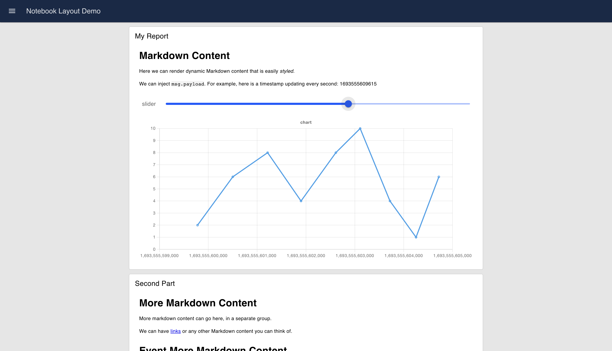
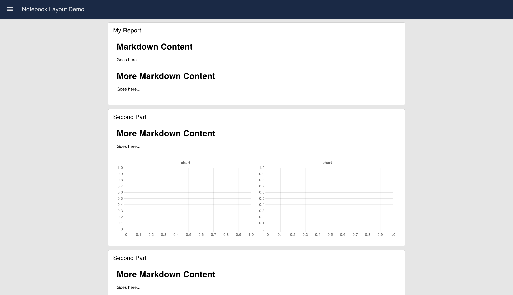
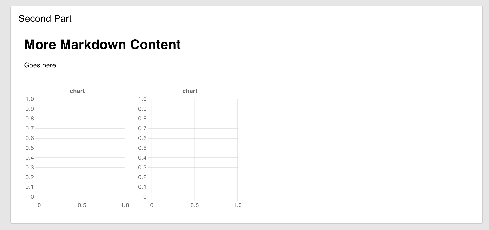
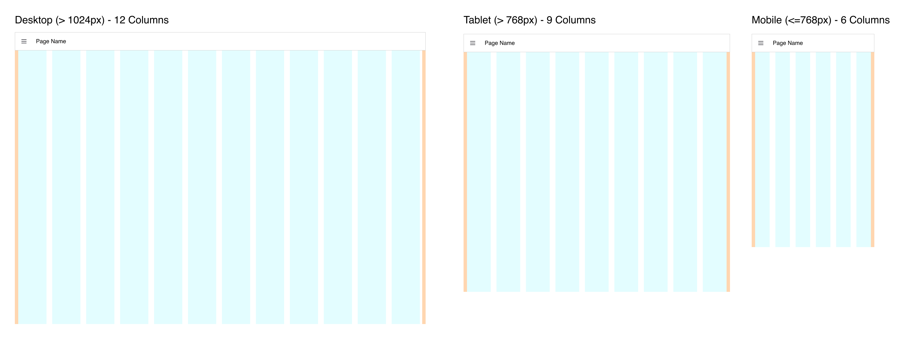

# Layout: Notizbuch <AddedIn version="0.4.0" />

Dieses Layout imitiert ein traditionelles Jupyter Notebook, bei dem das Layout auf 100% Breite gestreckt wird, bis zu einer maximalen Breite von 1024px, und zentral ausgerichtet ist.

Ein häufiger Anwendungsfall für diesen Layouttyp wäre das Einfügen von dynamischem Markdown, Datentabellen und Datenvisualisierungen.

{data-zoomable}
*Ein Beispiel für eine Benutzeroberfläche, die mit dem "Notizbuch"-Layout gerendert wurde*

## Steuerung von Breite & Spalten

Innerhalb des Notizbuchs selbst folgt die "Breite"-Eigenschaft denselben _Spalten_-Prinzipien des Rasterlayouts, über die Sie [hier](grid.md) mehr lesen können, jedoch mit einer vollen Standardbreite von "6".

Durch Erhöhen der "Breite" einer Gruppe erhöhen Sie tatsächlich die Anzahl der Spalten, die diese Gruppe darstellen wird, innerhalb derer die Widgets gerendert werden. Dies bietet die Möglichkeit, eine feinere Kontrolle über das Layout Ihrer Benutzeroberfläche zu haben, sodass Sie mehr Widgets nebeneinander in einer einzigen Zeile platzieren können, und hilft bei der Reaktionsfähigkeit Ihres Dashboards.

Eine Gruppe hat eine Standardbreite von "6" Spalten, wobei das gesamte Notizbuch ebenfalls eine Breite von "6" hat. Hier sehen wir zwei Diagramme, die nebeneinander gerendert werden, wobei jedes Diagramm eine Breite von "3" Spalten hat.

{data-zoomable}
*Ein Beispiel für eine Benutzeroberfläche, die mit dem "Notizbuch"-Layout gerendert wurde*

Wir können eine feinere Breitenkontrolle innerhalb einer Gruppe erhalten, indem wir ihre Breite erhöhen. Das Notizbuch selbst wird die Gruppe nicht breiter rendern, aber die Gruppe selbst wird intern mit 12 Spalten gerendert. Wenn wir also die "Breite" (Anzahl der Spalten) der Gruppe auf 12 erhöhen, dann sind die beiden Diagramme so eingerichtet, dass sie nur die Hälfte der Breite der Gruppe einnehmen (jeweils 3 Spalten).

{data-zoomable}
*Ein Beispiel für eine Benutzeroberfläche, die mit dem "Notizbuch"-Layout gerendert wurde*

## Breakpoints

Abhängig von der Bildschirmgröße kann sich die Anzahl der standardmäßig gerenderten Spalten ändern. Hier sehen Sie Beispiele für die gerenderten Spalten bei drei Breakpoints:

{data-zoomable}
_Richtlinien, die die in der "Raster"-Layout gerenderten Spalten bei verschiedenen Bildschirmgrößen demonstrieren_

Die genauen verwendeten Breakpoints können in den [Seiteneinstellungen](../../nodes/config/ui-page.md#breakpoints) konfiguriert werden.

Da Notizbuch-Layouts Gruppen in voller Breite rendern, wird die Anzahl der Spalten _innerhalb_ der Gruppe im Allgemeinen durch das _Minimum_ der Spalten/Breite der Gruppe und der Spalten der Seite bestimmt. Wenn also eine Gruppe 9 Spalten hat, das Seitenlayout jedoch aufgrund des Breakpoints 6 Spalten erzwingt, wird sie mit 6 gerendert. Wenn jedoch die Breite der Gruppe 6 beträgt und der Seiten-Breakpoint 12 Spalten definiert, wird die Gruppe dennoch mit 6 gerendert.