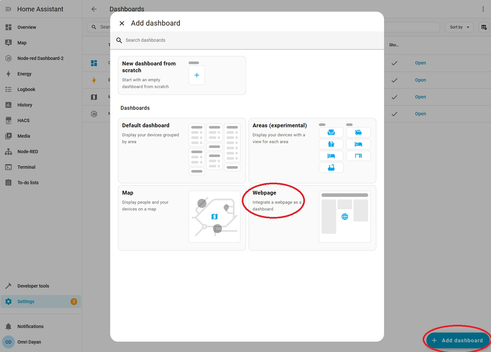
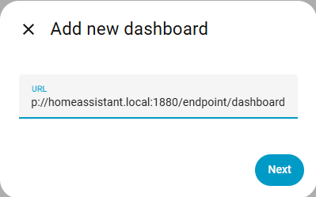
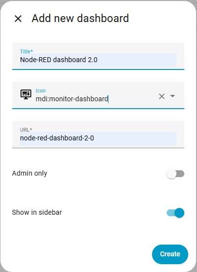
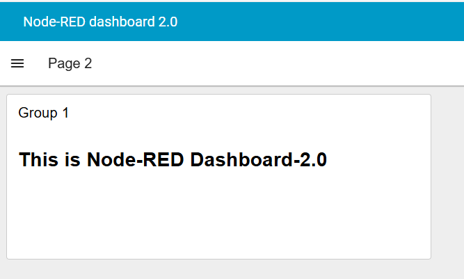

# Node-RED mit Home Assistant ausführen

Node-RED kann auf zwei Arten mit Home Assistant (**HA**) integriert werden:
1. Node-RED auf einem separaten Host ausführen und über HTTP-Messaging oder über das `node-red-contrib-home-assistant-websocket`-Node-Set eine Verbindung zum HA-Server herstellen

2. Verwendung des internen Node-RED-Add-ons innerhalb von HA, das Teil der Standard-HA-Installation ist

### Konfigurieren von FlowFuse Dashboard (Node-RED Dashboard 2.0) in Home Assistant

Aktuell enthält das Node-RED-Add-on innerhalb von HA die Node-RED Dashboard 1.0-Knoten (`node-red-dashboard`) und stellt dessen Basis-URL (`.../ui`) bereit. Node-RED Dashboard 1.0 ist jedoch mittlerweile veraltet und wurde durch FlowFuse Dashboard ersetzt.

Nachfolgend finden Sie Anleitungen zur Installation & Konfiguration von FlowFuse Dashboard im Node-RED-Add-on innerhalb von HA

1. Installieren Sie innerhalb des Node-RED-Add-ons das FlowFuse Dashboard-Node-Set (`@flowfuse/node-red-dashboard`) über die Option "Manage Palette".

2. Erstellen Sie einen neuen iframe-Container zum Hosten der FlowFuse Dashboard-Clients:
  - Gehen Sie in HA zu **Einstellungen->Dashboards->Dashboard hinzufügen** und wählen Sie **Webseite**

   *Hinzufügen eines neuen Dashboard-iFrames*  
  - Legen Sie die Basis-URL des Dashboards fest, z. B. `<HA host>:1880/endpoint/dashboard`

   *Festlegen der Basis-URL*  
   - Legen Sie den iframe-Titel & ein optionales Symbol fest (das in der HA-Seitenleiste angezeigt wird) und klicken Sie auf **Erstellen**

   *Festlegen von Titel & Symbol*  
  - Sie können das FlowFuse Dashboard nun über die HA-Seitenleiste oder direkt über die oben angegebene Endpoint-URL öffnen

   *Anzeigen des FlowFuse-Dashboards*
