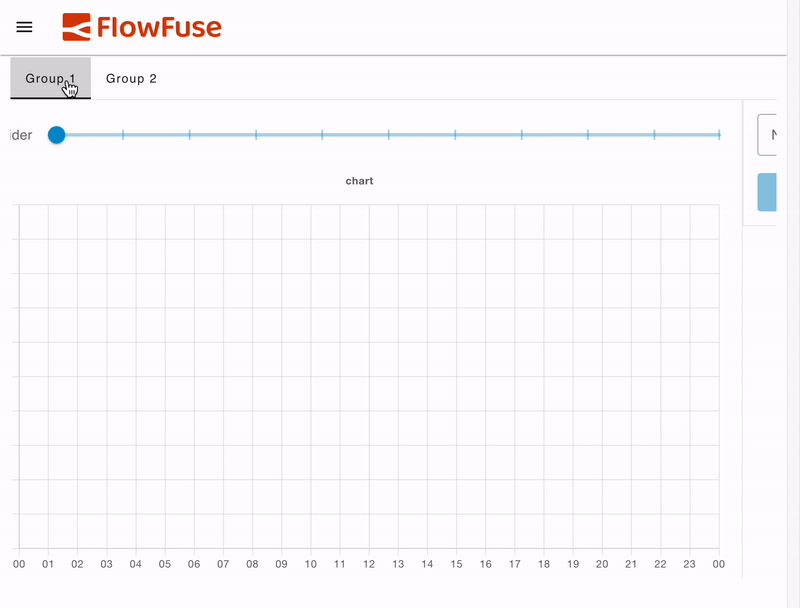

---
description:Render each group as a standalone Tab in a tabbed view for the page
---

# Layout: Tabs <AddedIn version="1.15.0" />

Rather than rendering each group side-by-side (as per Fixed and Grid layouts) or above and below each other (as per Notebook layout), the Tabs layout will render each group as a standalone Tab in a tabbed view for the page. You can then switch between the tabs to view the different groups.

{data-zoomable}
*An example UI rendered using the "Tabs" Layout, showing each "Group" as a Tab.*

Note that it's not currently possible to navigate to a page with a a particular tab open. The page will always open with the first tab selected.

## Controlling Width & Columns

Each tab will always render the full width of the screen. The "width" of each group then defines the number of columns that will be available within the tab.

For example, if you have a group with a width of 6, and two charts, each with a width of 3, they will render side-by-side within the tab, at 50% of the screen's width. If you then changed the group's width to be 12, the two charts would instead only take up 25% of the screen width each.

## Breakpoints

Depending on the screen size, the number of default columns rendered will change. Here you can see examples of the columns rendered at three breakpoints:

{data-zoomable}
_Guidelines demonstrating the columns rendered in the "Grid" Layout at different screen sizes_

The exact breakpoints used can be configured in the [page's settings](../../nodes/config/ui-page.md#breakpoints).

Also, because Tab layouts render groups at the full width of the screen, the number of columns _within_ the group is driven by the _minimum_ of the group's columns/width and the page's columns. So, in a case where a Group has 9 columns, if the page layout enforces 6 columns due to the breakpoint, it will render with 6. If however, the group's width is 6, and the page breakpoint defines 12 columns, the group will still render at 6.