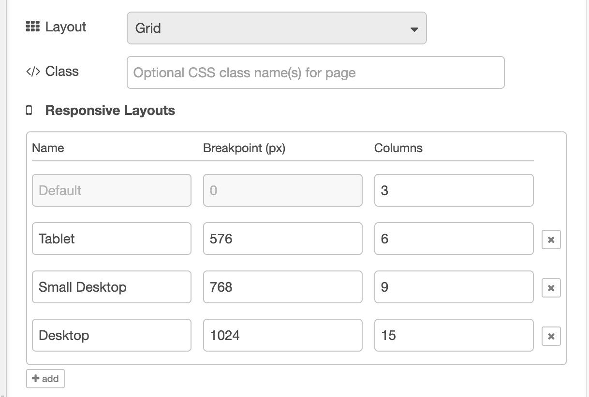

# Config: UI Page `ui-page`

Each page will be rendered in a navigation drawer within the UI, and can be accessed via the navigation bar at the top of the page. See [Layouts](../../contributing/guides/layouts) for more information on how layouts work.

## Properties

<PropsTable :hide-dynamic="true"/>

### Breakpoints

_Screenshot showing the default breakpoints configuration_

As detailed in the Layouts section of the documentation, most layout types in Dashboard utilise "breakpoints". Each breakpoint defines:

- A **pixel** value, i.e. when the breakpoint comes into effect
- A **columns** value, i.e. how many columns should be rendered at this breakpoint

The more columns you have, the more groups and widgets you can fit _side-by-side_ in your page. After this, new content will render to a new row.

Note that configurable breakpoints are not available for "Fixed" layouts as that does not use the column approach to rendering groups.

The default breakpoints are:

### Mobile

- **Breakpoint:** < 576px
- **Columns:** 3

### Medium

- **Breakpoint:** > 576px
- **Columns:** 6

### Tablet

- **Breakpoint:** 768px
- **Columns:** 9

### Desktop

- **Breakpoint:** 1024px
- **Columns:** 12

