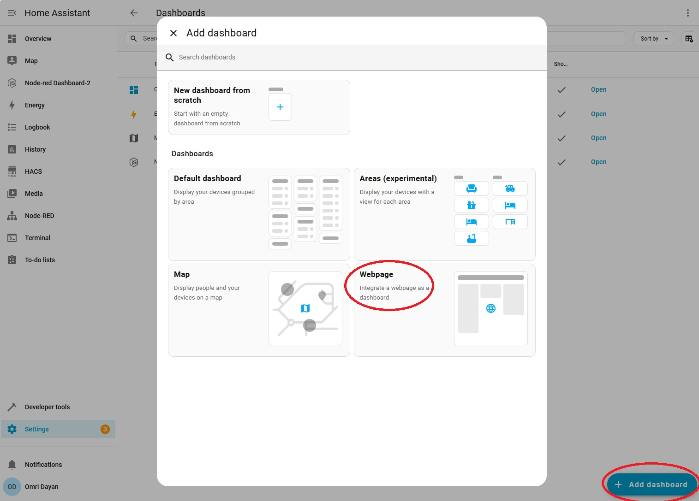
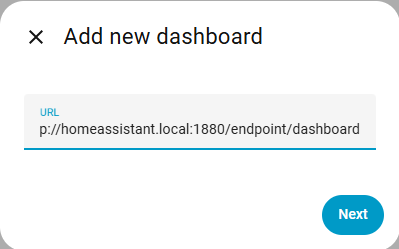
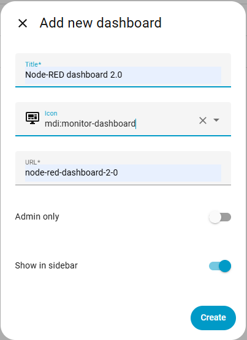
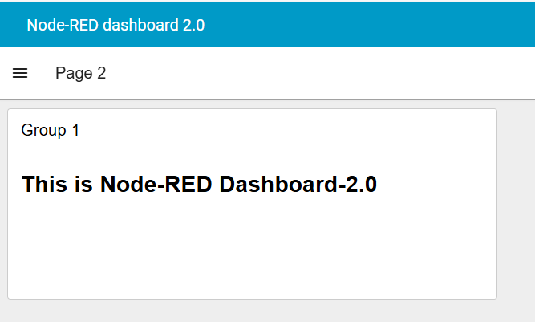

# Running Node-RED with Home Assistant

Node-RED can be integrated with Home Assistant (**HA**) in 2 modes:
1. Running Node-RED on an separate host, and connecting to the HA server via HTTP messaging or through the `node-red-contrib-home-assistant-websocket` node-set
   
2. Using the internal Node-RED add-on within HA, which comes as part of the default HA installation

### Configuring FlowFuse Dashboard (Node-RED dashboard 2.0) in Home Assistant

As of today, the Node-RED add-on within HA includes the Node-RED dashboard 1.0 nodes (`node-red-dashboard`), and exposes its base URL (`.../ui`). However, Node-RED Dashboard 1.0 is now deprecated and has been replaced by FlowFuse Dashboard. 

Below are guidelines for installing & configuring FlowFuse Dashboard in the Node-RED add-on within HA

1. Within the Node-RED add-on, install the FlowFuse Dashboard node-set (`@flowfuse/node-red-dashboard`) using the "Manage Palette" option.

2. Create a new iframe container for hosting the FlowFuse Dashboard clients:
  - In HA, go to **Settings->Dashboards->Add dashboard**, select **Webpage**
    
   *Adding a new dashboard iFrame*  
  - Set the base URL of the dashboard, e.g. `<HA host>:1880/endpoint/dashboard`
    
   *Setting the base URL*  
   - Set the iframe title & optional icon (which will show in the HA sidebar), and click **Create**
     
   *Setting the title & icon*  
  - You can now open the FlowFuse Dashboard from the HA sidebar, or directly via the endpoint URL defined above
  
   *Viewing the FlowFuse dashboard*
