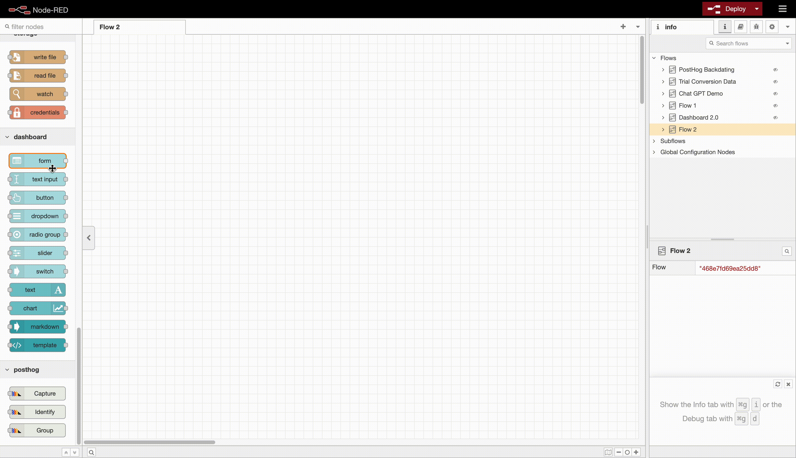
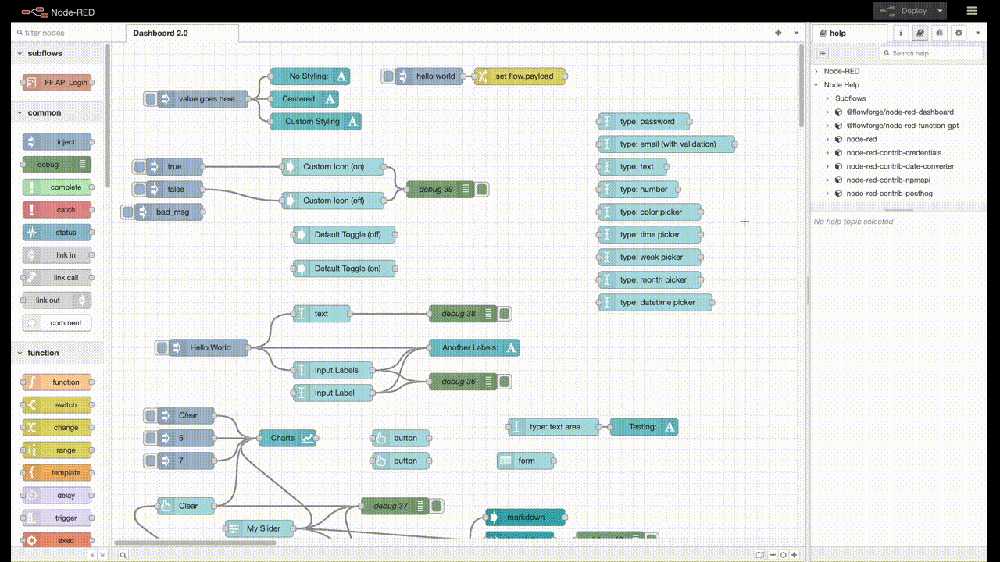

# Getting Started

## Installation

[FlowFuse](https://flowfuse.com)'s Node-RED Dashboard 2.0 is available in the Node-RED Palette Manager. To install it:

- Open the menu in the top-right of Node-RED
- Click "Manage Palette"
- Switch to the "Install" tab
- Search `node-red-dashboard`
- Install the `@flowforge/node-red-dashboard` package (not `node-red-dashboard`)

{data-zoomable}
*Screenshot showing the nodes available in the Node-RED Palette Manager*

The nodes will then be available in your editor for you to get started.

If you want to use `npm` to install your nodes, you can instead [follow these instructions](https://nodered.org/docs/user-guide/runtime/adding-nodes)

## Dashboard Hierarchy

Each Dashboard is a collection of widgets (e.g. charts, buttons, forms) that can be configured and arranged in our own User Interface. The hierarchy of a Dashboard is as follows:

- **Base** - Defines the base URL (e.g. `/dashboard`) for your Dashboard.
- **Page** - A given page that a vistor can navigate to, URL will extend the base, e.g. `/dashboard/page1`. Each page can also have a defined, unique, Theme which controls the styling of all groups/widgets on the page.
- **Group** - A collection of widgets. Rendered onto a page.
- **Widget** - A single widget (e.g. chart, button, form) created in Dashboard.

## Building a Dashboard

To get started, drop any widget from the flows on the left-side of Node-RED onto the editor.

{data-zoomable}
*Demo showing how to add a Dashboard widget to the Node-RED Editor*

### Initial Manual Step 

For the first widget you add, you will need to double click your new widget, and create your first group, page, theme and base. Once you have created these, you can add more widgets to the same group freely, and add any more groups/pages as you need to.

_Note: we do have a plan to automate this initial manual step of creating group/page/base - [issue](https://github.com/flowforge/flowforge-nr-dashboard/issues/66)._

## Managing your Dashboard

Once you have created a few widgets, groups and/or pages, you may want to make use of the Dashboard 2.0 sidebar. Sidebars are available on the right-hand side of the Node-RED interface. The down chevron provides access to more if you don't see Dashboard 2.0 in the initial tabs.

{data-zoomable}
*Demo showing how to open, and use, the Dashboard 2.0 sidebar*

The sidebar offers you a central place to manage your pages, groups and widgets. You can control the order that each of these appear in their respective parents, and even move widgets between groups, and groups between pages.

## Contributing

If you would like to run this set of nodes locally, and specifically to help contribute to the development efforts, you can read the [Contributing](./contributing/index.md) documentation.
