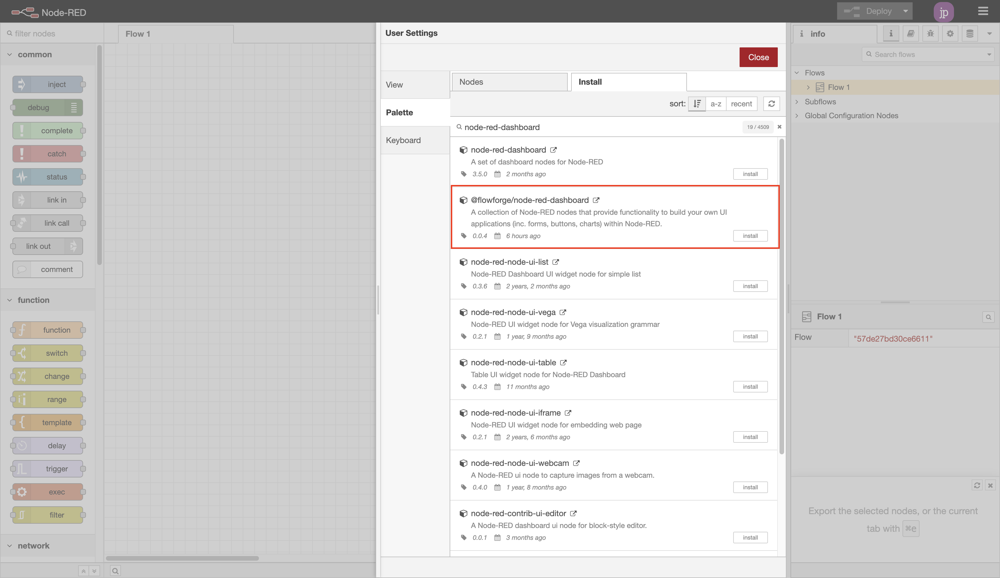
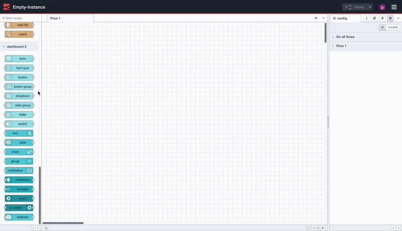
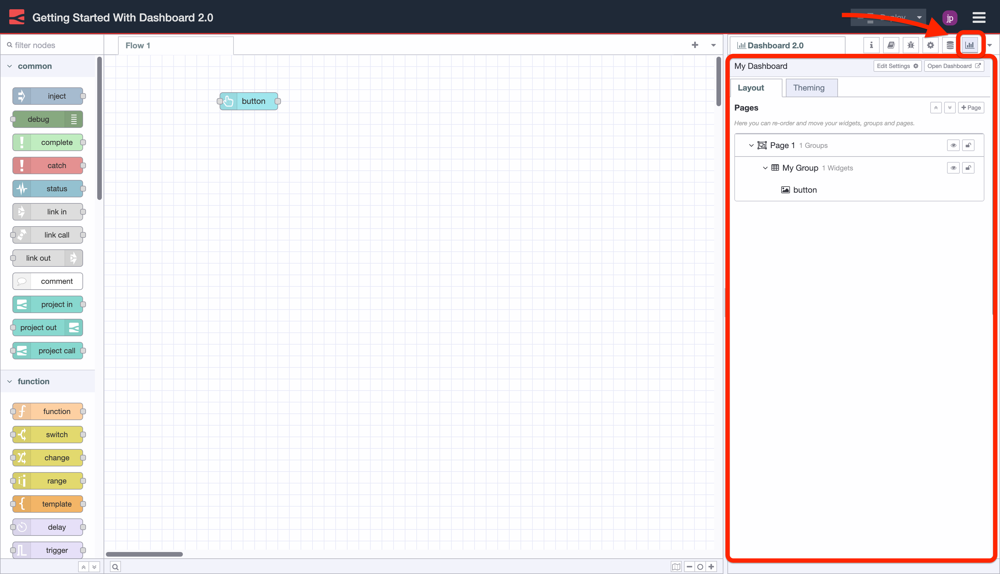
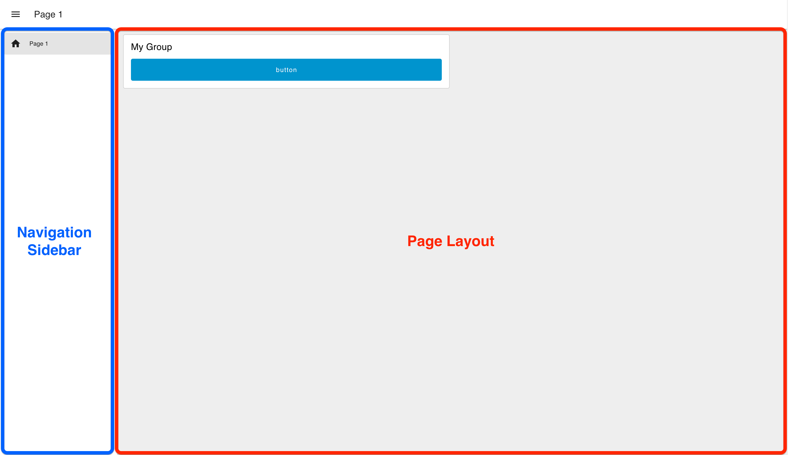

# Getting Started

## Installation

[FlowFuse](https://flowfuse.com)'s Node-RED Dashboard 2.0 is available in the Node-RED Palette Manager. To install it:

- Open the menu in the top-right of Node-RED
- Click "Manage Palette"
- Switch to the "Install" tab
- Search `node-red-dashboard`
- Install the `@flowfuse/node-red-dashboard` package (not `node-red/node-red-dashboard`)

{data-zoomable}
*Screenshot showing the nodes available in the Node-RED Palette Manager*

The nodes will then be available in your editor for you to get started.

If you want to use `npm` to install your nodes, you can instead [follow these instructions](https://nodered.org/docs/user-guide/runtime/adding-nodes)

## Dashboard Hierarchy

Each Dashboard is a collection of widgets (e.g. charts, buttons, forms) that can be configured and arranged in our own User Interface. The hierarchy of a Dashboard is as follows:

- **Base** - Defines the base URL (e.g. `/dashboard`) for your Dashboard.
- **Page** - A given page that a visitor can navigate to, URL will extend the base, e.g. `/dashboard/page1`. Each page can also have a defined, unique, Theme which controls the styling of all groups/widgets on the page.
- **Group** - A collection of widgets. Rendered onto a page.
- **Widget** - A single widget (e.g. chart, button, form) created in Dashboard.

## Adding your first widgets

With the nodes installed, getting started is as easy as choosing a node from the Palette (the left-hand side list of nodes) in Node-RED, and dropping it onto your canvas.

{data-zoomable}
_Screen recording to show how easy it is to deploy your first Dashboard 2.0 application._

In this case, we drop in a `ui-button`, click "Deploy" and then can see the button running live in our user interface.

Notice too that Dashboard will automatically create a new group, page, theme and base Dashboard for you.

## Configuring your layout

Dashboard 2.0 adds a correspinding "Dashboard 2.0" sidebar to the Node-RED editor . This sidebar provides an interface by which to view of your pages, themes, groups and widgets. From here you can add new pages and groups, modify existing settings, and re-order content to your liking.

{data-zoomable}
_Screenshot showing the Dashboard 2.0 sidebar in the Node-RED Editor._

Layout options in a Dashboard 2.0 user interface are controlled by two main settings:

- **Page Layout:** Controls how the `ui-groups`'s are presented on a given page in your application.
- **Navigation Sidebar:** Defines the left-side navigation style, defined at the `ui-base` level.

{data-zoomable}
_Example of the "Grid" page layout, with a "Collapsing" sidebar navigation._

### Layout Options

Currently, we have three different options for a page's layout:

- **Grid:** ([docs](https://dashboard.flowfuse.com/layouts/types/grid.html)) The default layout for a page. It uses a 12-column grid structure to layout the groups. The widths of each group or widget defines the number of columns they will render in. So, a "width" of 6" would render to 50% of the screen. Grid layouts are entirely responsive, and will adjust to the size of the screen.
- **Fixed:** ([docs](https://dashboard.flowfuse.com/layouts/types/fixed.html)) Each component will render at a _fixed_ width, no matter what the screen size is. The "width" property is converted a fixed pixel value (multiples of 48px by default).
- **Notebook:** ([docs](https://dashboard.flowfuse.com/layouts/types/notebook.html)) This layout will stretch to 100% width, up to a maximum width of 1024px, and will centrally align. It's particularly useful for storytelling (e.g. articles/blogs) or analysis type user interfaces (e.g. Jupyter Notebooks), where you want the user to digest content in a particular order through scrolling.

### Navigation Sidebar

Built into te frameowkr of hte UI is a side navigation bar, along with the top, page-wide "app bar". Configuration options exist such that the side navigation behavior can be controlled. Options include:

- **Collapsing:** When the sidebar is opened the page content will adjust with the width of the sidebar.
- **Fixed:** The full sidebar will always be visible, and the page content will adjust to the width of the sidebar.
- **Collapse to Icons:** When minimized, users can still navigate between pages by clicking on the icons representing each page in the sidebar.
- **Appear over Content:** When the sidebar is opened, the page is given an overlay, and the sidebar sits on top.
- **Always Hide:** The sidebar will never show, and navigation between pages can instead be driven by [`ui-control`](https://dashboard.flowfuse.com/nodes/widgets/ui-control.html).

## Contributing

If you would like to run this set of nodes locally, and specifically to help contribute to the development efforts, you can read the [Contributing](./contributing/index.md) documentation.

If you'd like to build your own standalone nodes & widgets that integrate seamlessly with Dashboard 2.0, you can read our guide on that [here](./contributing/widgets/third-party.md).
