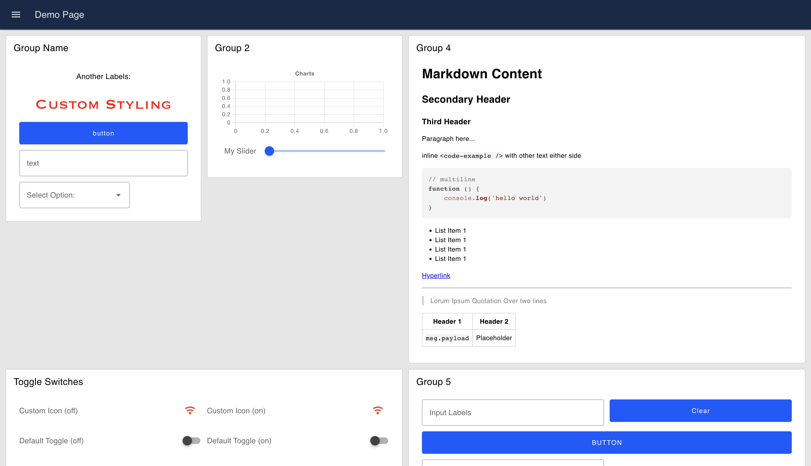

# Layout: Grid

This is a simple CSS Grid layout with 12 columns.

Each group's width represents the number of columns that it will populate in the overall Page's Grid layout, e.g. a Group, with width 12, will be full width of the screen, even when that screen width is changed.

The layout will automatically move widgets to the next row if they don't fit within a given row. The height of each row is determined by the tallest widget in that row.

{data-zoomable}
*An example UI rendered using the "Grid" Layout*