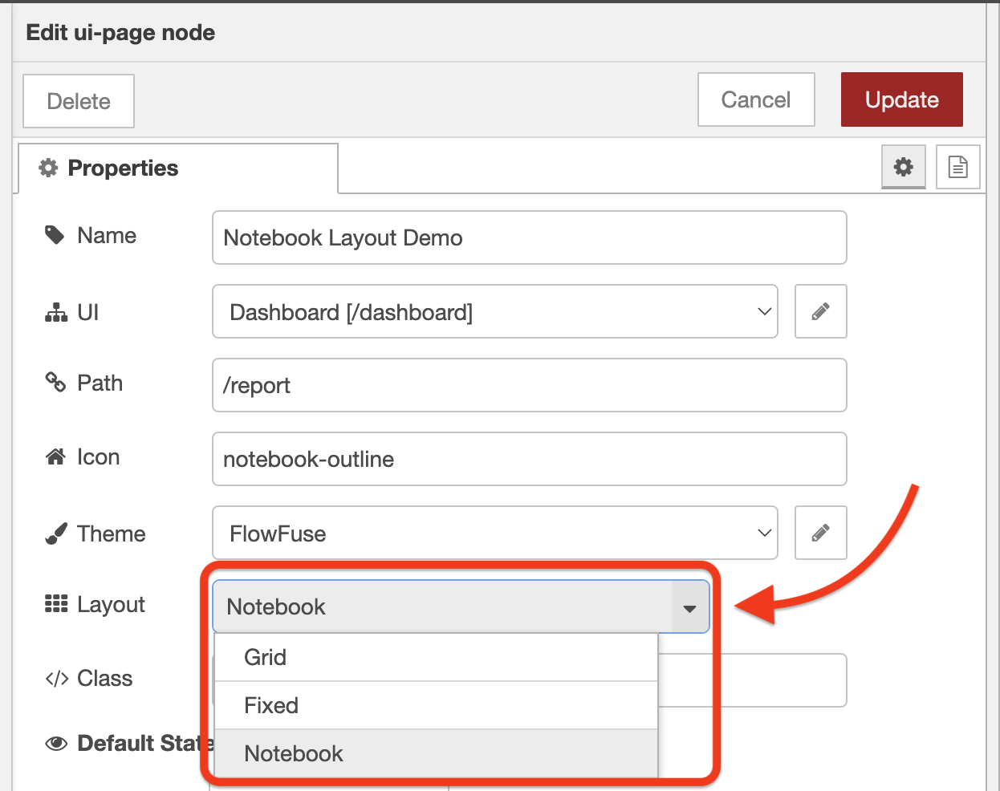
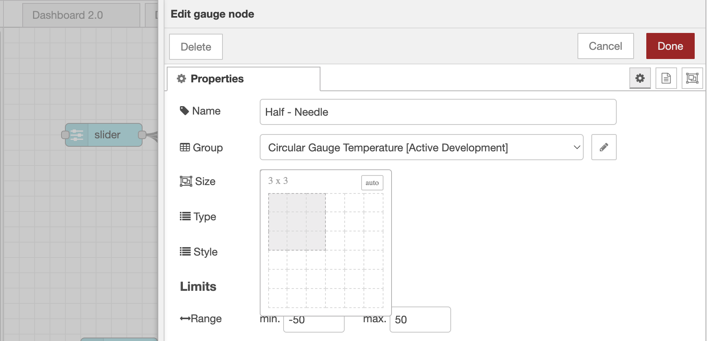
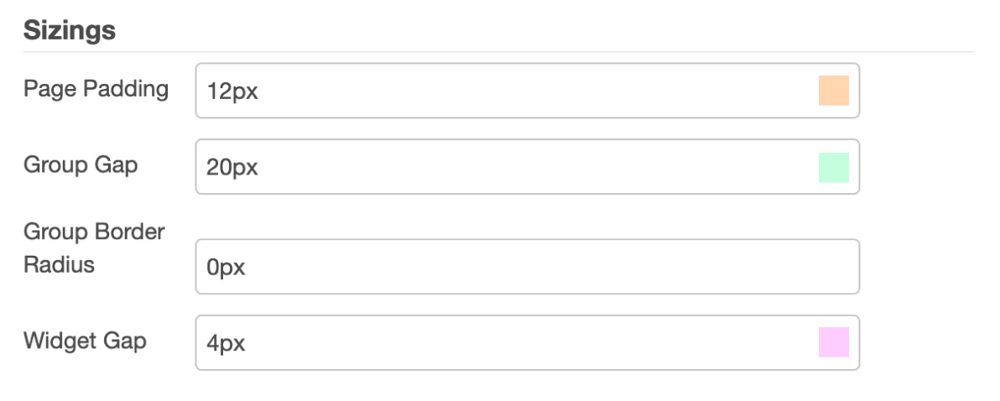
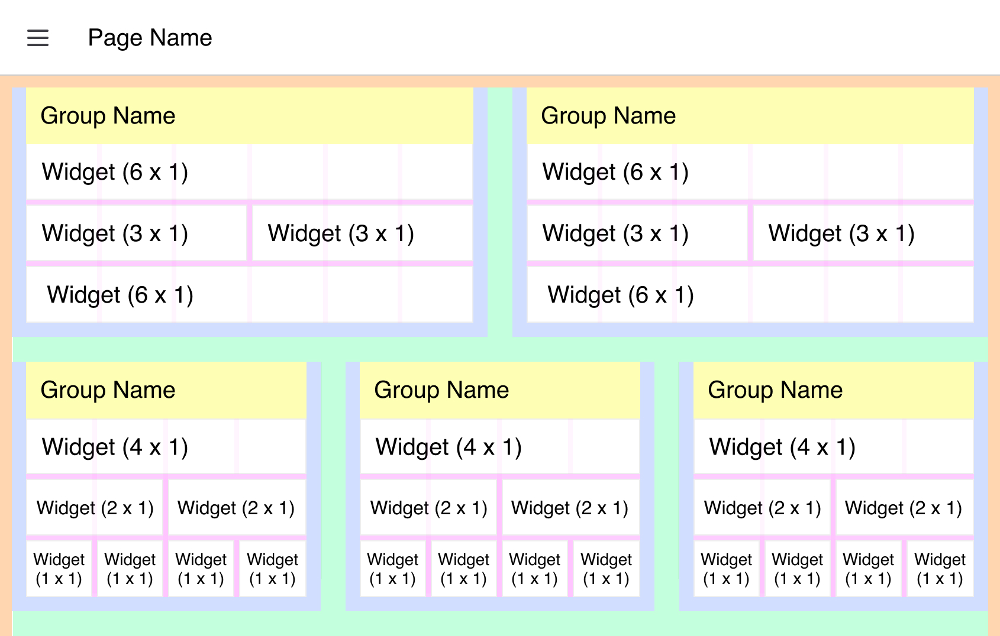

# Layouts

Layouts are a configuration available on a page-by-page basis. They control how all of the [Groups](../nodes/config/ui-group) of widgets are laid out on a given [Page](../nodes/config/ui-page):

{data-zoomable}
_Screenshot of the layout options on a `ui-page`_

We currently offer four different layout options:

- [Grid](./types/grid.md)
- [Fixed](./types/fixed.md)
- [Notebook](./types/notebook.md)
- [Tabs](./types/tabs.md)

## Sizing Groups & Widgets

A fundamental component of building out layouts in Dashboard 2.0 (which follows the Dashboard 1.0 principle) is the ability to control the size of each group and widget with the size selection widget:

{data-zoomable}
_Screenshot of the size selection widget for a ui-gauge_

Exactly what this sizing means does differ slightly depending on the layout you're using, but the general principle is that the size of a group or widget will control how much space it takes up in the layout. 

The core differences are in the "width" property of the size:

- For "Grid" and "Notebook", the width is calculated as a portion of 12 _columns_, i.e. a width of "6", would take up half of the width of the layout.
- For "Fixed", the width is calculated as a multiple of 90 _pixels_, i.e. a width of "3", would take up 270px of the screen.

## Theme Options

In addition to the core layout structure, defining how the groups are ordered and laid out, it is also possible to control some of the spacing in a layout through the page's [Theme](../nodes/config/ui-theme).

### Configurable Options

{data-zoomable}
_Screenshot of the theme options available to control sizings of the layout_

Each color here correlates to the respective section in the following image:

{data-zoomable}
_Screenshot of the theme options available to control sizings of the layout, here showing a "Grid" layout_

- **Page Padding:** The spacing that encapsulates the full page's content, depicted above as the orange space.
- **Group Gap:** The spacing between each group, depicted above as the green space.
- **Widget Gap:** The spacing between each widget, within a group, depicted above as the pink space.

An additional option available on a group-by-group basis is whether or not to show the Group's name, above depicted by the yellow space. If this is hidden, the Group Padding (blue), will render on all four sides of the group.

### Not Configurable (Currently)

Whilst we do offer reasonable levels of customization, there are some areas not currently configurable:

- **Row Height:** A single unit of height is currently fixed at 48px. This cannot be changed at this time. This also affects the "Fixed" layout, where a single unit of width is driven by this value.
- **Group Padding:** The spacing that encapsulates the full group's content, depicted above as the blue space.