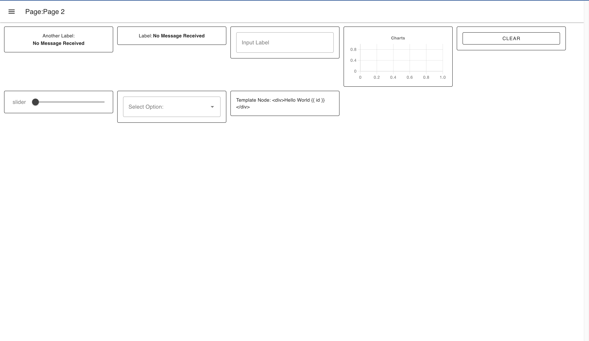

# Layout: Fixed

_Note: This layout still needs work to make it more flexible and practical, it is advised to use another layout for now._

Each "unit" is a fixed width, which was the only layout available in Dashboard 1.0. 

It is built as a flexbox layout, with a single row of widgets. Width of each group is a fixed pixel size, calculated as the "width" property of a group, multiplied by 90px (where our default row height is 45px).

The groups themselves follow the same pattern as all other layouts whereby a group of width "6" would have 6 "columns", with the widgets sizing accordingly, soa  widget of size "3 x 1" would be 50% of the group's width.

It will automatically move widgets to the next row if they don't fit within a given screen width, and does not change size with the screen size, which often leaves a lot of empty screen real estate. The height of each row is determined by the tallest widget in that row.

{data-zoomable}
*An example UI rendered using the "Fixed" Layout*

## Breakpoints

Below 576px, Fixed layouts will render in a responsive mode in order to support mobile rendering. Here, they actually become [Grid](../grid.md) layouts, with the width of each group being calculated as a portion of 3 columns, rather than a fixed pixel size.