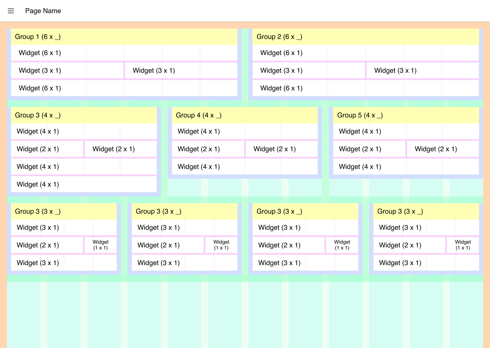

# Layout: Grid

Similar to Bootstrap's [Grid](https://getbootstrap.com/docs/4.0/layout/grid/) System, this provides 12 (by default) columns, within which content can be scaled. It is built as a CSS Grid layout.

Each group's width represents the number of columns that it will populate in the overall Page's Grid layout, e.g. a Group, with width 12, will be full width of the screen, even when that screen width is changed.

The layout will automatically move widgets to the next row if they don't fit within a given row. The height of each row is determined by the tallest widget in that row.

## Breakpoints

Depending on the screen size, the number of default columns rendered will change. Here you can see examples of the columns rendered at three breakpoints:

{data-zoomable}
_Guidelines demonstrating the columns rendered in the "Grid" Layout at different screen sizes_

### Desktop

- **Breakpoint:** 1024px
- **Columns:** 12

### Tablet

- **Breakpoint:** 768px
- **Columns:** 9

### Mobile

- **Breakpoint:** < 768px
- **Columns:** 6

## Controlling Width

Groups will populate the width as defined, and then they create their own grid layout internally where the number of columns in that group is equal to the width of the group. The groups can have their own internal paddings and pages that can be customized.

{data-zoomable}
_Guidelines demonstrating the columns rendered in the "Grid" Layout at different screen sizes_

You can read more about these customizations to the theme and layout [here](../index.md).

## Controlling Empty Space

Controlling empty space can be tricky with a Grid Layout. We do not have a smart masonry layout ([example](https://masonry.desandro.com/layout)) currently, instead we are utilizing [CSS's Grid Layout Module](https://www.w3schools.com/css/css_grid.asp).

As such, the height of a given "row" of widgets is determined by the tallest widget in that row.

Most widgets will strictly abide by their widget and height specified, however, some (e.g. `ui-template` or `ui-markdown`) will grow with their content, even if that means surpassing the height specified in the widget's config.

Here, we can see an example of a rendered Grid layout in Dashboard 2.0:

{data-zoomable}
*An example UI rendered using the "Grid" Layout*