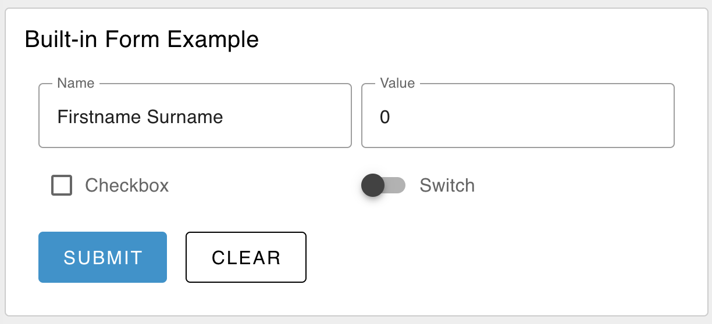

---
props:
    Group: Defines which group of the UI Dashboard this widget will render in.
    Size: Controls the width of the button with respect to the parent group. Maximum value is the width of the group.
    Label: A label shown before the form rows.
    Form Elements: >
        A list of the rows presented in the form. Each row has the following properties:
        <ul>
            <li>Label: A label shown in the form row.</li>
            <li>Name: The name of the form element, which will be used as the key in the <code>msg.payload</code> object.</li>
            <li>Type: The type of input to display. Options - <code>text | multiline | password | email | number | checkbox | switch | date | time</code></li>
            <li>Required: Whether the form element is required to be filled in before the form can be submitted.</li>
    Buttons: The text shown on each of the form's buttons. If "cancel" text is left empty, then no cancel button will be shown.
    Two Columns: Will render the form as a two-column layout.
    Topic: Defines how to compute the topic, included in the `msg` object, when the form is submitted.
---

# Form `ui-form`

Adds a form to user interface which helps to collect multiple value from the user on submit button click as an object in `msg.payload`.

## Properties

<PropsTable/>

## Example

{data-zoomable}
*Example of a rendered form in a Dashboard.*
