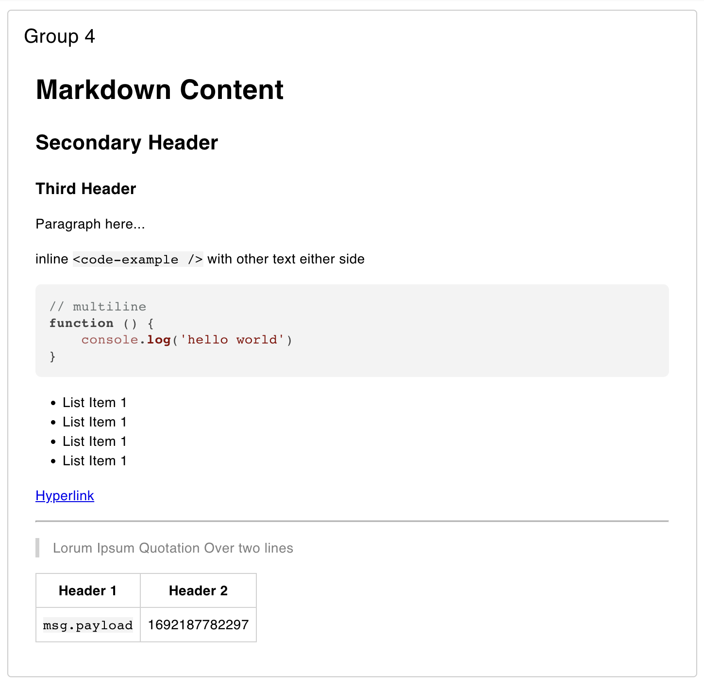

---
props:
    Group: Defines which group of the UI Dashboard this widget will render in.
    Content: The markdown to be passed to the UI and rendered
---

<script setup>
</script>

# Markdown Viewer `ui-markdown`

Allows for markdown to be defined within Node-RED editor and rendered into the UI. Can be use for rendering labels, headers or even full blog articles.

You can inject `msg` values into the markdown using:

::: v-pre
`{{ msg?.payload }}`
:::

This will be replaced with the value of `msg?.payload` when a message is received to the node. If you'd like to have a placeholder value before a message is received you can use:

::: v-pre
`{{ msg?.payload || 'Placeholder' }}`
:::

If you're looking for a quick cheat sheet on how to write Markdown, you can check out FlowFuse's guide [here](https://flowfuse.com/handbook/development/markdown-how-to/#markdown-how-to).

## Properties

<PropsTable/>

## Example

{data-zoomable}
*Example of rendered markdown in a Dashboard.*

The above example is rendered using the following markdown:

````md
# Markdown Content

## Secondary Header

### Third Header

Paragraph here...

inline `<code-example />` with other text either side

```js
// multiline
function () {
    console.log('hello world')
}
```

- List Item 1
- List Item 1
- List Item 1
- List Item 1

[Hyperlink](https://news.bbc.co.uk)

---

> Lorum Ipsum Quotation Over two lines 

| Header 1 | Header 2 |
|-|-|
| `msg.payload` | {{ msg.payload || 'Placeholder' }} |
````
