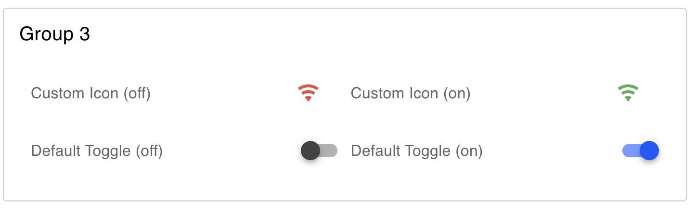

---
props:
    Group: Defines which group of the UI Dashboard this widget will render in.
    Size: Controls the width of the button with respect to the parent group. Maximum value is the width of the group.
    Label: The text shown within the button.
    On Payload: The type & value to output in <code>msg.payload</code> when the switch is turned on.
    Off Payload: The type & value to output in <code>msg.payload</code> when the switch is turned off.
---

# Toggle Switch `ui-switch`

Adds a toggle switch to the user interface.

## Properties

<PropsTable/>

## Example

{data-zoomable}
*Example of a rendered switch in a Dashboard.*
