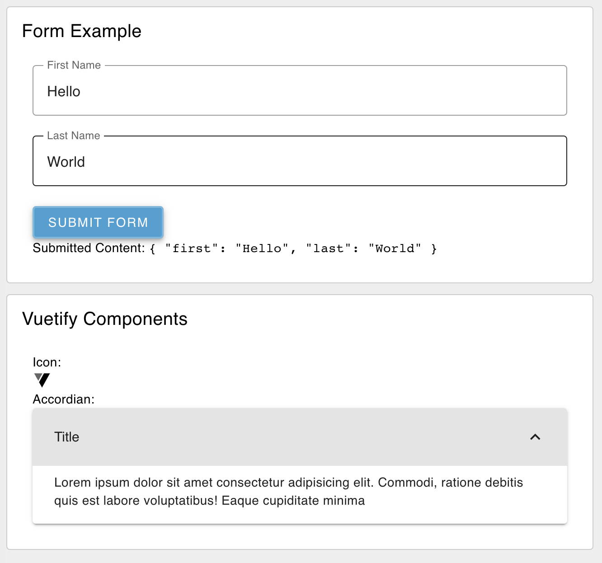

---
props:
    Group: Defines which group of the UI Dashboard this widget will render in.
    Scope: Template nodes can be used  for 3 purposes/scopes. Firstly, as a standard HTML widget rendered in a group in the Dashboard. Alternatively, to define custom CSS classes/styling for a page/UI. This scope defines the extent of which any CSS defined in a <style> tage will be applied.
    Class: Appends CSS classes to the widget
    Template: The content of the widget or CSS <style>. If using this for CSS, you do not need to include any <style> tags, as these will be automatically added.
---

# Text `ui-template`
 
Provide custom HTML (including any [Vuetify components](https://vuetifyjs.com/en/components/all/)) to render in the Dashboard.

The template also has access to two built-in functions:

- `send` - Outputs a message (defined by the input to this function call) from this node in the Node-RED flow. 
- `submit` - Send a `FormData` object when attached to a `<form>` element. The created object will consnist of the `name` attributes for each form element, corresponding to their respective `value` attributes.

_Note: Currently restricted to custom HTML only, but there are plans to add `<style>` and `<script>` editors in the future too (track [here](https://github.com/flowforge/flowforge-nr-dashboard/issues/115))._

## Properties

<PropsTable/>

## Example

{data-zoomable}
*Examples of variants of ui-template, one with a functional form, and another showing use of random Vuetify components.*
