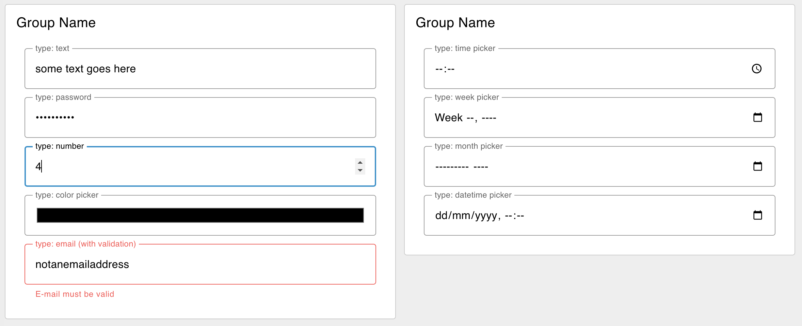

---
props:
    Group: Defines which group of the UI Dashboard this widget will render in.
    Size: Controls the width of the button with respect to the parent group. Maximum value is the width of the group.
    Label: The text shown within the button.
    Mode: The type of HTML input to display. Options - text | password | email | number | tel | color | date | time | week | month | datetime-local
    Passthrough: If this node receives a msg in Node-RED, should it be passed through to the output as if a new value was inserted to the input?
---

# Button `ui-text-input`

Adds a single text input row to your dashboard, with a configurable "type" (text, password, etc).

## Properties

<PropsTable/>

## Example

{data-zoomable}
*Example of a rendered button in a Dashboard.*
