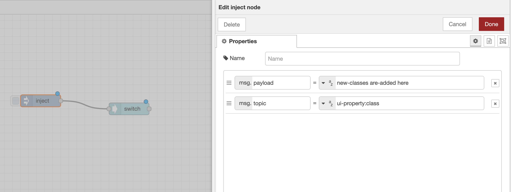

# Dynamic Properties

Node-RED offers functionality to set properties of a node at runtime. This can be useful to generate dynamic functionality and behaviour, and in Node-RED Dashboard 2.0, this is possible on any field supported with the _"fx"_ icon.

You can hover over the tooltip/icon to get details on how to set that particular property.

{data-zoomable}
*Dynamic Property Option on "Class" for the UI Switch node*

In Dashboard 2.0 we follow a formal schema to set any properties utilising the `msg.topic` and `msg.payload`. Dynamic messages take the format:

```json
{
    "topic": "ui-property:<property>",
    "payload": "<value>"
}
```
## Example: Dynamic Class for UI Switch

So, in the case of a UI Switch where we want to dynamically change the `class` property, we would send a message like:

```json
{
    "topic": "ui-property:class",
    "payload": "new-classes are-added here"
}
```

{data-zoomable}
*Dynamic Property Option on "Class" for the UI Switch node*

This would add three new classes to the ui-switch widget (`new-classes`, `are-added` and `here`), which would then be applied to the widget when the message is sent.