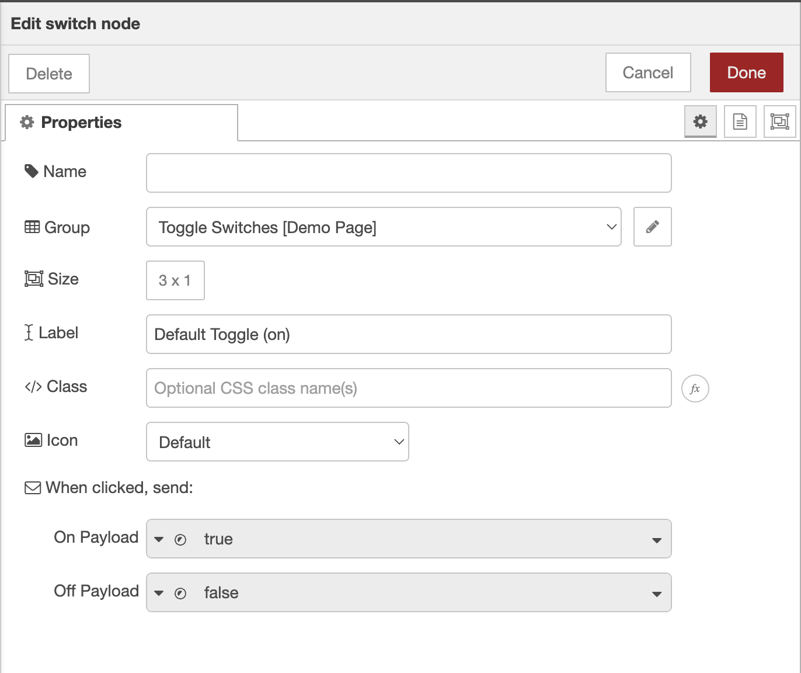

# Dynamic Properties

Node-RED offers functionality to set properties of a node at runtime. This can be useful to generate dynamic functionality and behaviour, and in Node-RED Dashboard 2.0, this is possible on any field supported with the _"fx"_ icon.

You can hover over the tooltip/icon to get details on how to set that particular property.

{data-zoomable}
*Dynamic Property Option on "Class" for the UI Switch node*

Details of the Dynamic Properties are also found within the in-Editor help for each Dashboard node.

If we consider an example with a `ui-button`, you can send the following `msg` to the button itself:

```json
{
    "class": "my-class"
}
```

Please note that for `class` updates, the class is appended the widget's container, so this means that your class' style definitions may need to take that into account. If you want to affect the background-color of a button for example:

```css
.my-class button.v-btn {
    background-color: red;
}
```

Will do the trick. Notice that we sometimes have to over-define the CSS selector to ensure that the style is applied correctly, overriding any underlying Vuetify/built-in stylesheets.
