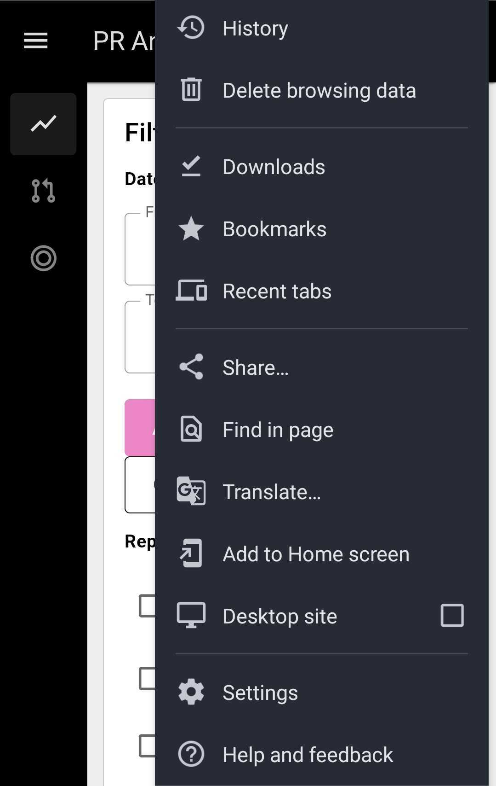
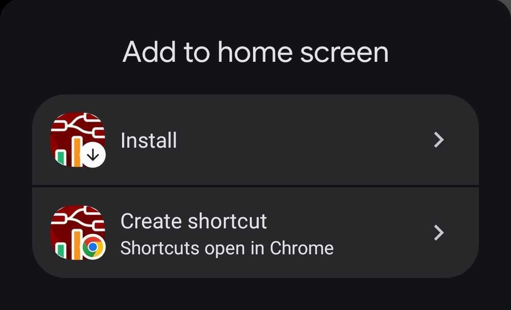
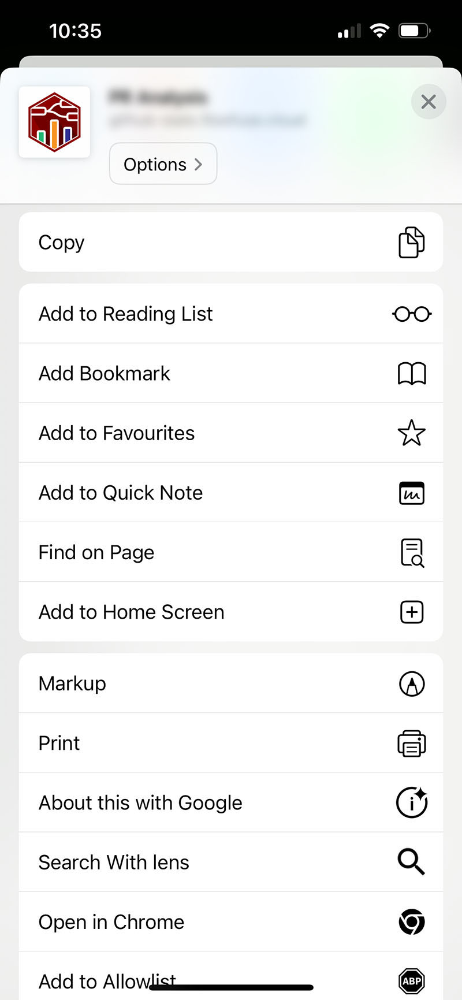
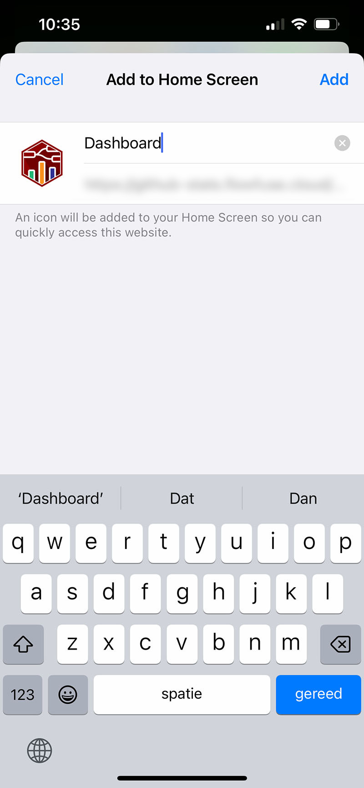

# Installing Dashboards on Mobile <AddedIn version="1.9.0" />

Node-RED Dashboard 2.0 is built and deployed as a [Progressive Web App](https://developer.mozilla.org/en-US/docs/Web/Progressive_web_apps). This means whilst it's built as a web application, it can be installed on your mobile device and run as a standalone application, behaving as if it was a native app.

## Installing on Android

To install the Dashboard on an Android device, open the browser and navigate to your Dashboard. From the browser's options, select _"Add to Home Screen"_ (you may be presented directly with an option to _"Install"_ here, depending on your Chrome version):

<em>Options presented in Chrome on Android</em>

This will then prompt you to either "Install" Dashboard as an application, or "Create a Shortcut" on your home screen:

<em>Options presented in Chrome on Android</em>

If you install, the Dashboard will be added to your home screen and can be launched as a standalone application, without the surrounding Browser experience.

## Installing on iOS

To install the Dashboard on an iOS device, open the browser and navigate to your Dashboard. From the browser's options, select _"Add to Home Screen"_:

<em>Options presented in Safari on iOS</em>

You'll then be prompted to name your application:

<em>Options presented in Safari on iOS</em>