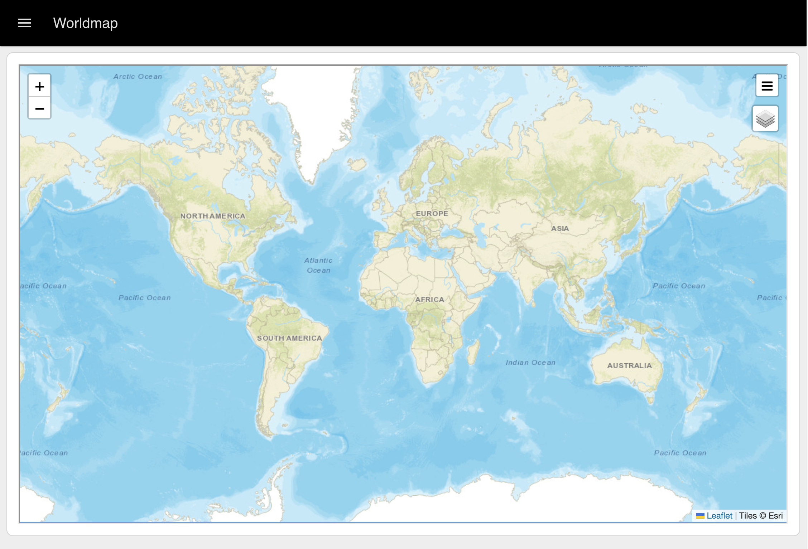

<script setup>
    import { ref } from 'vue'
    import FlowViewer from '../components/FlowViewer.vue'
    import ExampleFlowWorldmap from '../examples/template-worldmap.json'
    import ExampleDataTable from '../examples/template-data-table.json'
    import ExampleFileUpload from '../examples/file-upload.json'

    const examples = ref({
      'worldmap': ExampleFlowWorldmap,
      'custom-data-table': ExampleDataTable,
      'file-upload': ExampleFileUpload
    })
</script>

# UI Template Examples

The UI Template node allows you to create custom widgets for your dashboard, as well as define custom CSS to style your dashboard in anyway you like.

To help get you started on these, we've collected a few useful examples that you can use or modify to suit your own needs.

## Widgets

### Custom Data Tables

Whilst we do offer the [`ui-table`](../nodes/widgets/ui-table.md) widget out of the box, it's fairly basic in it's functionality, and doesn't allow for much customization of cells and styling. 

In Dashboard 1.0, there was a popular third-party `ui-table` widget, which offered wider customisation, but for Dashboard 2.0, we've taken a slightly different approach. Rather than defining a spec that you must put your data into, in order to utilise a set number of features in a library, with Dashboard 2.0, you can use the `ui-template` to customise a data table in anyway you like, and with any data format.

{data-zoomable}
_Example of a custom header and cell content using ui-template and Vuetify's Data Table_

Here we take a look at how you can use the UI Template node, and [Vuetify's Data Table](https://vuetifyjs.com/en/components/data-tables/basics/#usage) (which is what we use under the covers in `ui-table` anyway), to make data tables with unlimited customisations:

```vue
<template>
    <!-- Provide an input text box to search the content -->
    <v-text-field v-model="search" label="Search" prepend-inner-icon="mdi-magnify" single-line variant="outlined"
    hide-details></v-text-field>
    <v-data-table v-model:search="search" :items="msg?.payload">
      <template v-slot:header.current>
        <!-- Override how we render the header for the "current" column -->
        <div class="text-center">Center-Aligned</div>
      </template>

      <template v-slot:item.target="{ item }">
        <!-- Add a custom suffix to the value for the "target" column -->
        {{ item.target }}°C
      </template>

      <template v-slot:item.current="{ item }">
        <!-- Render a Linear Progress Bar for the "current" column -->
        <v-progress-linear v-model="item.current" min="15" max="25" height="25" :color="getColor(item)">
          <template v-slot:default="{ value }">
            <strong>{{ item.current }}°C</strong>
          </template>
        </v-progress-linear>
      </template>
    
    </v-data-table>
</template>

<script>
    export default {
    data () {
      return {
        search: ''
      }
    },
    methods: {
        // add a function to determine the color of the progress bar given the row's item
      getColor: function (item) {
        if (item.current > item.target) {
          return 'red'
        } else {
          return 'green'
        }
      }
    }
  }
</script>
```

Where we pass in data such as:

```json
[
    {
        "room": "Living Room",
        "id": "1234",
        "target": 18.1,
        "current": 20
    },
    {
        "room": "Bathroom Room",
        "id": "5678",
        "target": 19.5,
        "current": 18
    },
    {
        "room": "Kitchen Room",
        "id": "9101",
        "target": 18.1,
        "current": 17.6
    }
]
```

Vuetify's Data Table will automatically render a column for each item in the data provided, by default it will just render it as text (as we do in `ui-table`). However, we can also use the `<template v-slot:item.property />` syntax to override how we render a particular cell.

#### Important Note: Case Sensitivity

This is only relevant if you wish to use `<template>` overrides in your `v-data-table` to customize the appearance of a cell or header.

Due to a limitation in the way that HTML renders, you cannot use capital letters in DOM templates. This means that if you have a property in your data called `myProperty` or `My_Property`, then we need to transform it to an HTML-friendly format, before we can include it in `<template v-slot:item.property="{ item }">`. 

This transformation can be achieved using the `v-data-table`'s `headers` option which allows us to map values and keys.

```vue
<template>
    <div id="app">
        <v-text-field v-model="search" label="Search" prepend-inner-icon="mdi-magnify" single-line variant="outlined"
            hide-details></v-text-field>
        <v-data-table v-model:search="search" :headers="headers" :items="msg?.payload" class="elevation-1" :items-per-page="20">
            <template v-slot:header.lowercase>
                <div>custom <b>html</b> title</div>
            </template>
            <template v-slot:item.snake_case="{ item }">
                ${{ 3 * item.snake_case }}
            </template>
        </v-data-table>
    </div>
</template>

<script>
    export default {
    data () {
      return {
        search: '',
        headers: [
            // a basic header definition
            { title: 'kebab-case', key: 'kebab-case' },
            { title: 'slithering', key: 'snake_case'},
            // we can also skip defining a title here,
            // and use v-slot (see in HTML above) instead
            { key: 'lowercase' },
            // if we need to transform due to case sensitivity, we can do so like this:
            { title: 'Date & Time', key: 'camel-case', value: item => item['camelCase']},
            // we can also add JS transformation to our values too
            { title: 'All Caps', key: 'macro-case', value: item => item['MACRO_CASE'].toUpperCase()}
        ],
      }
    },
  }
</script>
```

In summary, the different ways to handle case sensitivity are:

| Type | Transform Required |
|------|--------------------|
| `kebab-case` | No |
| `snake_case` | No |
| `lowercase` | No |
| `camelCase` | Yes |
| `MACRO_CASE` | Yes |

You can try out the above example with this flow:

<FlowViewer :flow="examples['custom-data-table']" height="200px"/>

### File Upload

When building applications with Node-RED, there's often a need to process files for analysis. In such cases, we require a file upload widget which is not currently available. Fortunately, we can achieve this easily using the `ui-template` widget and Vuetify JS components.

To do that we will use the [`v-file-input`](https://vuetifyjs.com/en/components/file-inputs/) component which provides the interface for uploading files.

```javascript
<template>
    <!-- Card for uploading binary file -->
    <v-card raised color="white">
        <!-- Card Title -->
        <v-card-title>Upload binary file to Node-Red</v-card-title>
        <br>
        <v-card-text>
            <!-- File Input -->
            <v-file-input label="Click here to select a file" show-size v-model="uploadFile">
            </v-file-input>
            <!-- Progress Indicator -->
            <div>Progress: {{ progress }} bytes loaded</div>
        </v-card-text>
        <v-card-actions>
            <v-spacer></v-spacer>
            <!-- Upload Button -->
            <v-btn right @click="startUpload">Upload File</v-btn>
        </v-card-actions>
    </v-card>
</template>

<script>
    export default {
        data() {
            return {
                uploadFile: null, // Holds the selected file
                progress: 0 // Progress indicator for file upload
            }
        },
        methods: {
            // Method triggered when Upload File button is clicked
            startUpload() {
                // Check if a file is selected
                if (!this.uploadFile) {
                    console.warn('No file selected');
                    return;
                }

                // Log the selected file information to console
                console.log('File selected:');
                console.log(this.uploadFile);

                // Create a FileReader instance to read the file
                const reader = new FileReader();

                // When the file is read, send it to Node-RED
                reader.onload = () => {
                    // Prepare the payload to send
                    const payload = {
                        topic: 'upload', // Topic for Node-RED
                        payload: this.uploadFile, // File content
                        file: {
                            name: this.uploadFile.name, // File name
                            size: this.uploadFile.size, // File size
                            type: this.uploadFile.type // File type
                        }
                    };
                    
                    // Send the payload to Node-RED (assuming 'send' method is defined)
                    this.send(payload);
                };

                // Track progress of file reading
                reader.onprogress = (event) => {
                    this.progress = event.loaded; // Update progress
                };

                // Read the file as an ArrayBuffer
                reader.readAsArrayBuffer(this.uploadFile);
            }
        },
    }
</script>
```

To add a file upload component to your dashboard, insert the above Vue snippet into the ui-template widget. This snippet allows importing the file, and after clicking the upload button, it first tracks the progress of the file reading process and shows how much of the file is read. Once the file is fully loaded, it sends the message object to the subsequent node containing the file and related information for further processing. However, it's important to note that this sends the buffer arrays, which we are converting into strings using the change node in the following example.

<FlowViewer :flow="examples['file-upload']" height="200px"/>

Additionally, please be aware that when using this example with Node-RED default settings, it will only accept files up to 1MB. The dashboard uses `socket.io` for communication, which has a default limit of 1MB. You can increase this limit by changing the following value in the `settings.js` file. For more information, refer to the [Settings](https://dashboard.flowfuse.com/user/settings.html).

```javascript
dashboard: {
    maxHttpBufferSize: 1e8 // size in bytes, example: 100 MB
}
```

### World Map

Node-RED has a very popular [worldmap node](https://flows.nodered.org/node/node-red-contrib-web-worldmap) which allows for intricate plotting of data on a globe. The node creates a new endpoint onto your web server at `/worldmap` (or whichever path you override the default with).

{data-zoomable}
_Example of a World Map rendered in Dashboard 2.0_

In order to display a worldmap into Dashboard 2.0, currently, the best way to do this is with a `ui-template` node:

```vue
<template>
    <iframe src="/worldmap" class="worldmap"></iframe>
</template>
<style>
  .worldmap {
    width: 100%;
    height: 100%;  
  }
</style>
```

#### Example Flow

<FlowViewer :flow="examples['worldmap']" height="300px"/>

## Custom Styling

A lot of the styling for Node-RED Dashboard 2.0 is driven by the underlying [Vuetify](https://vuetifyjs.com/en/) library, which we use to render many of the widgets. This often means that, when defining your own CSS, we need to override the underlying Vuetify classes.

To add your own CSS you can add a `ui-template` node and select one of the following "Type" options:

- **CSS (Single Page)** - This will add the CSS to the `<style>` tag of a single page, and only that page.
- **CSS (All Pages)** - This will add the CSS to the `<style>` tag of all pages in your Dashboard.

Here are a few examples we've put together based on common requests we've seen in the forums.

### Font

{data-zoomable}
_Example of a custom header and cell content using ui-template and Vuetify's Data Table_

To modify the default font used in your Dashboard, you can override the `font-family` field at the `body` level, which would ensure it's covered across _all_ elements in your Dashboard:

```css
body {
    font-family: monospace;
}
```


### Background Image

If you'd like to have a custom texture or background image such as:

{data-zoomable}
_Example of a custom header and cell content using ui-template and Vuetify's Data Table_

You can use the following CSS:

```css
.v-main {
    background-image: url("	https://www.transparenttextures.com/patterns/batthern.png");
    background-repeat: repeat;
}
```

### Group Styling

{data-zoomable}
_Example of styling applied to the Groups rendered in Dashboard 2.0_

Groups in Node-RED Dashboard are made of a wrapping container with a class of `nrdb-ui-group`, and then a block within that which you see visually as the group, which is a Vuetify Card widget, and so has the class `v-card`.

We can use these classes to style the groups in our Dashboard, for example, to make the border's thicker we could define:

```css
/* All .v-card's inside a group */
.nrdb-ui-group .v-card {
    border-width: 10px;
}
```

### Navigation Styling

{data-zoomable}
_Example of how to override the \"navigation drawer\" styling in Dashboard 2.0_

By default, the side navigation drawer that lists all of the pages in your Dashboard is styled in accordance with the "Navigation" colour in your Theme. This means that its `background-color` will match the header of the Dashboard too. If you'd like to override this, you can do so by using the `.v-navigation-drawer` class:

```css
.v-navigation-drawer {
    background-color: white;
    color: black;
}
```
